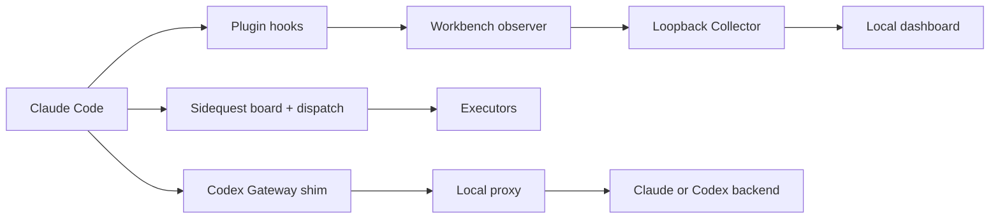

Toolshed is a marketplace of independent Claude Code plugins. Hooks run at Claude Code lifecycle points, local observers turn selected activity into counts, and the dashboard reads the resulting loopback data. Sidequest keeps tickets and dispatch policy in its own store. Codex Gateway sits in front of the model API only when you choose a gateway model.

See [modular toolshed architecture](./architecture/modular-architecture/) for the file-based integration points and category routing rules.
