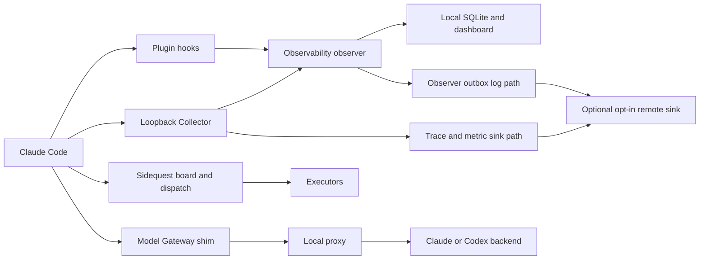

## Maintainer overview

Eigenwise Toolshed is a marketplace of independent Claude Code plugins. Each plugin owns its setup, hooks, skills, and local state. The plugins cooperate through small, explicit boundaries rather than importing one another's implementation.

```mermaid
flowchart LR
  CC[Claude Code] --> H[Plugin hooks]
  H --> O[Observability observer]
  CC --> C[Loopback Collector]
  C --> O
  O --> D[Local SQLite and dashboard]
  O --> L[Observer outbox log path]
  C --> T[Trace and metric sink path]
  L --> R[Optional opt-in remote sink]
  T --> R
  CC --> S[Sidequest board and dispatch]
  S --> E[Executors]
  CC --> W[Model Gateway shim]
  W --> P[Local proxy]
  P --> API[Claude or Codex backend]
```

- Quartermaster owns the cross-plugin setup plan for new and existing projects, updates Toolshed plugins, and checks workspace health.
- Codebase Mapper and Live Rules add project context without requiring the other plugins.
- Observability records selected metadata locally. Its observer and Collector listeners stay on loopback, while an optional opt-in remote sink receives logs through the observer outbox and traces or metrics through the Collector path.
- Sidequest owns tickets, stories, routing, dispatch, and executor evidence.
- Model Gateway owns the optional model-proxy boundary. Claude models can keep their normal API path.

See [modular Toolshed architecture](./modular-architecture/) for the registry and routing boundaries. User-facing installation and daily use belong in the [plugin guides](../getting-started/), not here.
