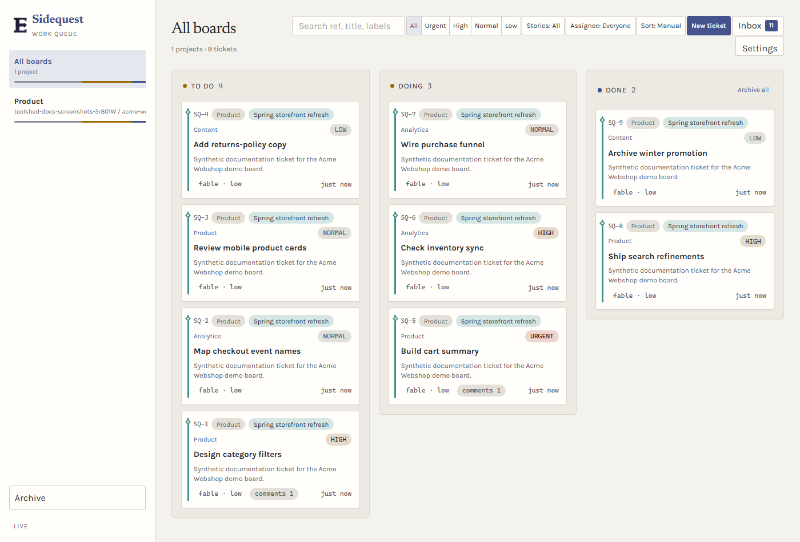
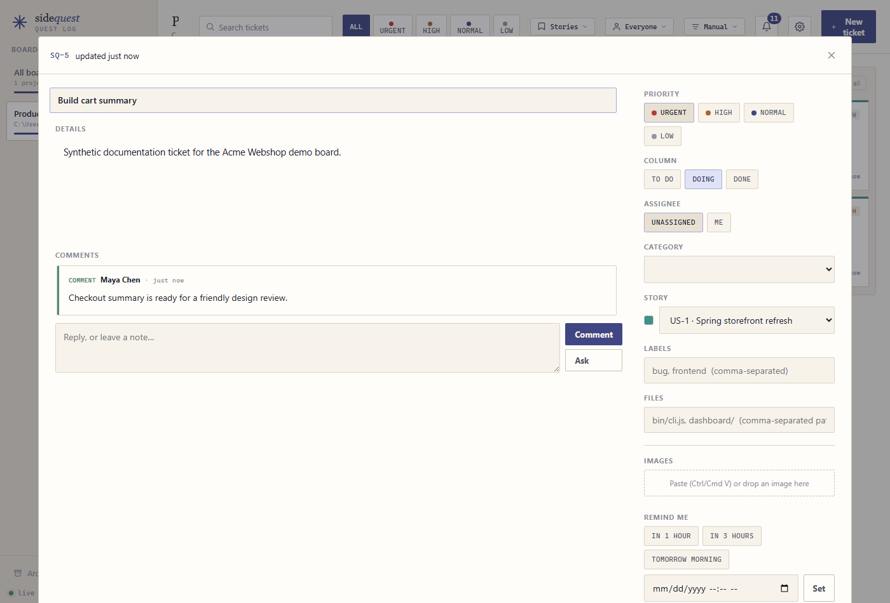

Sidequest is a local Kanban board for Claude Code work.

```text
/plugin install sidequest@eigenwise-toolshed
```

Reload Claude Code, then open the board with `/sidequest:board`. The dashboard spans projects, while each ticket keeps its project path and status. You can also use the Sidequest MCP tools or CLI to add, update, and close tickets.

## Categories and dispatch

Categories describe the kind of work and carry executor guidance, a model route, and an effort. Choose one by its description, not its name. The add result repeats the category description and resolved route so a bad match is visible right away. **Default settings** are shared by every board. **Board settings** fork a category for one board, and the dashboard marks each category as inherited or customized. Resetting a customized category relinks it to the defaults.

Keep trivial lookups inline: a couple `Read`, `Glob`, `Grep`, or `WebFetch` calls that answer one question. Tracing a code path across files is a spike ticket. Every delegated task goes through a ticket and routed dispatch, including an investigation: file a spike (usually `codebase-exploration`), dispatch it, then spawn the returned executor. Routing selects the model, so Sidequest has no unrouted delegation path.

A board can opt out of routed dispatches with `sidequest routing disabled --project <board>`. Turn routing back on with `sidequest routing enabled --project <board>` before dispatching. A direct claim is a justified inline exception on a routed ticket and needs a reason.

The main agent is the orchestrator and the most expensive model in the session. Executors are cheaper, so offload implementation and investigation by default; the main agent reads only enough to write a well-anchored ticket. On the first prompt in each session, an active routed board lists its live executor categories and routes. **REQUIRED:** substantive work uses a ticket and dispatch. Trivial lookups are exempt. After five main-thread substantive actions, Sidequest gives three more substantive actions, then **BLOCKS** `Edit`, `Write`, `NotebookEdit`, and non-read Bash until a board interaction occurs. It also adds one read-spiral notice after twelve `Read`, `Grep`, `Glob`, or pure-read Bash actions with no board interaction. Reads stay allowed, and both paths skip subagents, automation prompts, and boards with routing disabled.

## Work a ticket

Route delegated work with `sidequest dispatch SQ-3`, then spawn the returned executor unchanged. Dispatch requires a real ticket description, at least 80 characters, because that description is the executor's entire brief. Include **Where**, **Contract**, and **Verify**. Coding and debugging tickets without a verify command still dispatch, but return a warning. The executor claims with the returned token and executor, commits declared paths, and submits its verified commit for the orchestrator to publish.

A bounded documentation artifact can stay as working-tree output when its ticket declares that directory as its only file scope, dispatches with `--shared-tree` (MCP: `sharedTree:true`), and includes this exact line: `Shared-tree artifact mode: leave the generated map as working-tree output; verify, comment, and close with done. Do not commit, submit, push, or edit source.` Sidequest pins the mode, scope, and existing dirty paths at dispatch. `done` accepts changes inside that scope and refuses newly dirty paths outside it, while leaving pre-existing caller dirt alone. Other tickets with a live claim, active dispatch, or pending submission still commit and submit. `update --status done` refuses routed dispatch history even after release. During board grooming, release any stale claim and use `done`/`completeTicket` for work that already landed; the completion records who closed it and when.

For a genuinely executor-ineligible inline exception, claim directly with a reason: `sidequest claim SQ-3 --by <unique-worker-id> --direct --reason "why no executor can do this"` (MCP: `direct:true`, `reason`). Routed tickets require at least 20 reason characters. Browser reproduction and review have routed executors, so dispatch those instead. Do not start either path until its claim succeeds.

Use `/sidequest:groom` to audit stale tickets and `/sidequest:sidequest` when you need board administration. Keep a ticket's file scope accurate so parallel work stays isolated. `docs/` is always in scope on boards whose repo has a root docs directory, so a required prose update ships with the implementation. View or replace that board-level list with `sidequest board-config` or `sidequest board-config --always-in-scope docs/ --always-in-scope <path>` (MCP: `board_config`).

A scoped commit commits its declared paths even when another changed file is outside the ticket. Sidequest reports those paths in the commit result, records a ticket comment, and carries them in the submission as `unscopedPaths`; make a second scoped commit after widening scope, or discard them. Missing declared paths are warnings when other declared paths can be committed.

Run `sidequest worktrees --sweep` from a board repo to inspect stale executor worktrees. It only plans removals by default. `--yes` removes finished, integrated, or already-merged clean `agent-*` worktrees, then prunes Git's worktree registry. Dirty, ahead, locked, and current worktrees stay put.




