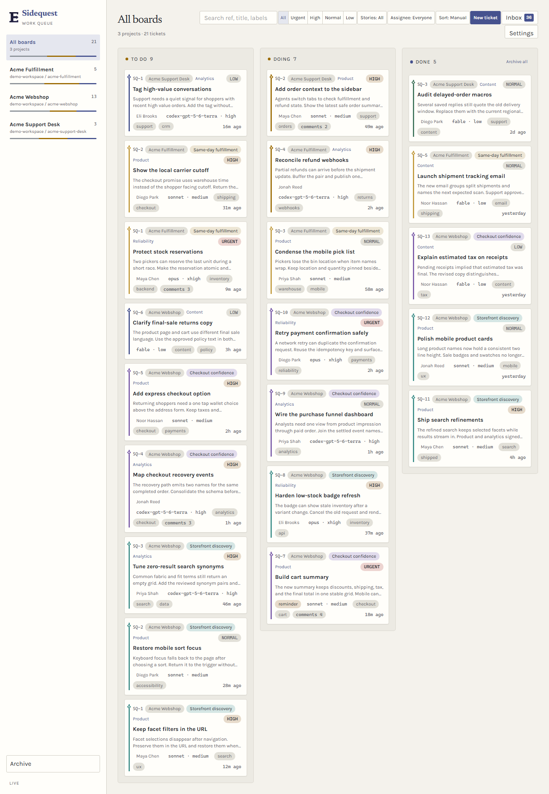
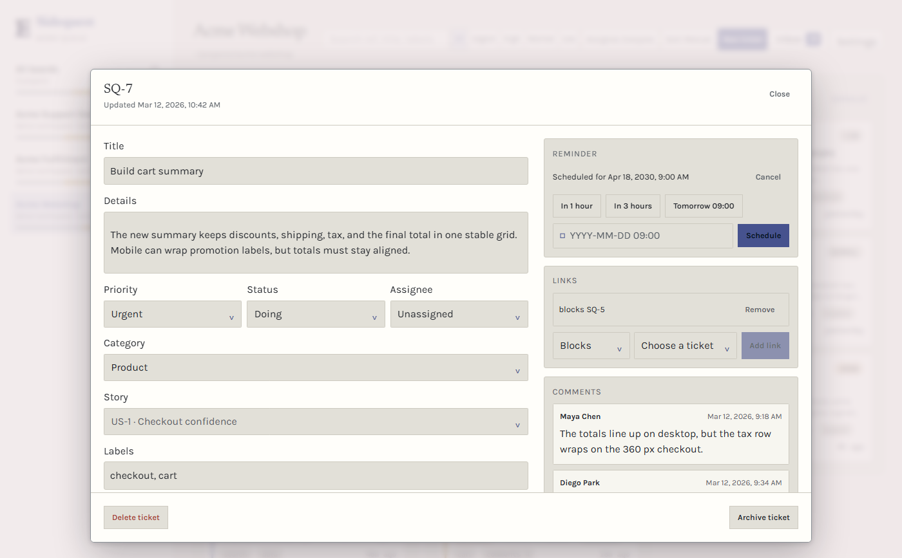

Sidequest is a local Kanban board for Claude Code work.

```text
/plugin install sidequest@eigenwise-toolshed
```

Reload Claude Code, then open the board with `/sidequest:board`. The dashboard spans projects, while each ticket keeps its project path and status. You can also use the Sidequest MCP tools or CLI to add, update, and close tickets.

## Quick start

1. Install Sidequest with the plugin command above, then reload Claude Code.
2. File a ticket with `sidequest add -t "Ship the next change" --category <id>`.
3. Dispatch it with `sidequest dispatch <ref>`, then spawn the returned executor unchanged.
4. After the executor submits its verified commit, integrate it with `sidequest integrate <ref> --by <who>`.

See [CLI basics](#cli-basics) for command details and [Work a ticket](#work-a-ticket) for the full dispatch and integration flow.

### Verification during ticket work

Generated executors use focused checks while they iterate, then run the ticket's recorded verification command once before submitting. The executor derives the focused command from that ticket command and the project's task scripts, so it tests the changed file or consumer without assuming every project has the same test runner.

### Take the dashboard tour

The dashboard starts a guided tour the first time you open it. It is an orientation for reading a board where agents file and execute much of the work. Fifteen short steps move from boards, columns, cards, and full ticket details to the inbox, search and filters, the archive, routing settings, filing a ticket yourself, and archiving or deleting a board from its right-click menu. Each step highlights the real surface, and the ticket and board-menu steps open the real UI so you can see the ticket details, executor comments, and board actions without changing anything. Deleting a board is low-stakes: Sidequest creates it again when an agent starts Sidequest work in that project.

Use Next, Back, the arrow keys, or Enter to move through the tour. Press Escape or Skip to leave it. If you stop partway through, the dashboard remembers your place and resumes there next time. After you finish or skip, it stays out of the way.

To replay it, open Settings and choose **Replay the tour** under Appearance. You can also press `?` anywhere on the board. The tour state is stored in local storage for this browser, so clearing site data or using another browser or profile starts it over.

## CLI basics

Check the installed CLI version with `sidequest --version` (also `sidequest -V` or `sidequest version`). Add `--help` to a command for its usage, for example `sidequest add --help`; use `sidequest help` for the full command list.

Preview a ticket before writing it with `sidequest add -t "title" --category <id> --dry-run`. The preview validates the input and shows what would be created without changing the board. The flag also appears in the profile and merge command forms where those commands support a preview.

`sidequest list` and the MCP `list` tool show active tickets by default. Pass `--status done` or `status: "done"` to inspect completed work, or `--all` / `all: true` for every non-archived status. The dashboard keeps its Done column. List results are paged, so follow `nextCursor` when one is returned. `sidequest models` and the MCP `models` tool return compact routes by default; use `--full` or `full: true` for configured routes, resolved executors, and warnings.

Manage user stories through `sidequest story add|list|show|update|rm` or the compact MCP `story` tool. Pass `action: "add" | "list" | "show" | "update" | "rm"`; `show`, `update`, and `rm` take a story `ref` or `id` in `story`. The MCP `story_contract` tool reads or updates execution contracts separately.

### Story contracts and decision logs

A multi-ticket wave starts with a story: file the backlog under it and pin an execution contract before dispatching the work. The contract sets the rules for the wave and outranks later log entries.

Executors can leave short findings for later waves with the story decision log:

```text
sidequest story log US-27
sidequest story log US-27 -m "DECISION: Keep the MCP surface separate from story CRUD" --ref SQ-952 --by executor-1
sidequest story log US-27 --body-file finding.txt --ref SQ-952 --by executor-1
sidequest story log US-27 --clear --by orchestrator
```

Without an entry or `--clear`, the command reads the log. Entries are one-line `DECISION:`, `CONSTRAINT:`, or `DISCOVERY:` findings. Use `-m` or `--body-file`, and attach `--ref` and `--by` when recording work. The `story_log` MCP tool provides the same read, append, and clear operations.

Later-wave briefings include the live log automatically. Keep entries under 280 bytes, with a 4 KiB limit for the whole rendered packet. A full log refuses new entries, so fold durable findings into the story contract at integration, then clear the log.

## Board display names

A board has a stable board ID and an editable display name. The display name is for people and can change; the board ID, repository path, ticket refs, claims, and links stay the same. Use the CLI to set or view the name:

```text
sidequest board-config --name "Client work" --project <path-or-slug>
```

The MCP equivalent is `board_config` with `name: "Client work"` and the board's project or path. Use the board ID or path when you need to target a board reliably; renaming it does not create or move a board.

## Categories and dispatch

### Routing profiles

Routing profiles hold a complete category set and keep each board's policy independent. Every board points at one profile, then applies its own local rows as overrides, additions, pins, or disabled entries. A profile edit propagates to every board pointing at it; local changes stay local and the dashboard shows their provenance.

Starter profiles include `coding`, `creative-music`, `research`, and `writing`. The init-workspace interview proposes one after scanning the repository. Accept it, pick another, or create a project profile from a starter. Shared starters are never changed by setup.

### Profile commands

Manage profiles with the CLI:

```text
sidequest profile list [--retired] [--json]
sidequest profile show <profile> [--json]
sidequest profile create <profile> [--from <profile>] [--name ...] [--description ...]
sidequest profile edit <profile> [--name ...] [--description ...]
sidequest profile retire <profile>
sidequest profile use <profile> --project <board>
sidequest profile repoint <from> <to> [--dry-run] [--json]
sidequest profile promote <new> --from-project <board> --project <board>...
sidequest profile new-board [<profile>] [--json]
```

`repoint --dry-run` previews changed, added, and missing categories plus local drift. `promote` copies a board's effective taxonomy into a new profile and repoints the selected boards when their taxonomies match. `new-board` reads or sets the profile used for future boards. Profiles can also be managed through the matching Sidequest MCP tools.

### Category scope and routing

Category commands require an explicit scope. Use `--profile <profile>` for profile entries and `--project <board>` for board-local changes. A mutation with neither scope fails. `global-fallback` remains the availability fallback used after category routes and category fallbacks.

### Provider fallback and refusal

When a Claude Opus dispatch fails before claim because its subscription capacity or entitlement is exhausted, Sidequest prepares that category's configured Codex fallback with a fresh token. The ticket continues on the replacement executor, while dispatch, board, CLI, and MCP reads show the executor actually used. Other provider failures leave the route alone. Category and board-local overrides still win over this recovery path.

When a ticket is routed to a GPT model and Codex is not ready, Sidequest refuses the dispatch instead of quietly running it on a Claude model. The old behavior silently spent Anthropic quota on work routed to the subscription backend. A healthy same-provider route can still fall back automatically, and the dispatch records that fallback. Cross-provider substitution is opt-in and always announced.

The refusal includes the recovery. If `claude-code-proxy` is missing, run `node <plugin>/bin/model-gateway.js setup`, then retry. If ChatGPT sign-in is required, run `node <plugin>/bin/model-gateway.js login`, finish browser OAuth, then run `node <plugin>/bin/model-gateway.js setup` and retry. Credentials live in `~/.config/claude-code-proxy/`, not `~/.claude`. If a Windows upgrade hits a locked executable, the old proxy is retained, so reboot and run `node <plugin>/bin/model-gateway.js setup`. For an OpenAI rejection, run `node <plugin>/bin/model-gateway.js setup`; if it persists, wait for a `claude-code-proxy` update or explicitly re-route the ticket.

Categories describe the kind of work and carry executor guidance, a model route, and an effort. Choose one by its description, not its name. The add result repeats the category description and resolved route so a bad match is visible right away. The board applies local overrides on top of the selected profile, and the dashboard marks each row as profile, override, pinned, board-only, or disabled.

### Category and comment reads

Compact MCP reads for `category_list` and `comments` return `total`, `returned`, and `nextCursor`. Follow `nextCursor` until it is null. Compact category descriptions and comment bodies mark excerpts explicitly; `full:true` returns exact text. Compact comments are newest-first for orchestration, while full comments stay chronological. `full:true` without a cursor or limit keeps the one-call complete response. The CLI JSON shapes do not use this pagination and remain unchanged.

For tickets with more than 10 comments, default CLI and MCP comment reads keep all metadata but elide the oldest comment bodies, with an explicit omitted-count marker. Long orchestrator sessions can re-bill tool results, so this keeps routine reads smaller. Use `sidequest comments SQ-n --full` or the MCP `comments` tool with `full:true` to restore every body. Tickets with 10 or fewer comments are unchanged. Dashboard and REST reads are unaffected.

### Executor guidance

Use read-only tools or native `Explore` to gather enough evidence for precise tickets, then route implementation by default. Use informed inline judgment when it fits. Routed implementation work goes through a ticket and dispatch. Helpers are limited to `Explore`, `claude-code-guide`, `web-researcher`, and `general-purpose` for genuinely uncategorized bounded work, mechanical sweeps, or documentation research; classify matching work through board categories first, use an explicit cheap model, keep helpers in the background, and route audit or review work through a `review-audit` ticket. Evidence that would require searching session, transcript, or task-output files is self-reference, not a finding. Other delegated implementation, investigation, research, review, or domain analysis needs a ticketed route.

Read-only executors can use any MCP server you have configured, so a visual-review ticket can use Playwright and a research ticket can use a docs MCP. Their repository contract stays read-only: Bash is available for inspection, tests, and verification, but they do not modify the working tree. If a configured MCP can push to a remote or write files, use the per-board `readOnlyDeniedTools` setting to subtract matching tools from the resolved list, for example `readOnlyDeniedTools: ["mcp__remote__*"]`.

### Session reminder and routing toggle

A board can opt out of routed dispatches with `sidequest routing disabled --project <board>`. Turn routing back on with `sidequest routing enabled --project <board>` before dispatching, or use a direct claim for deliberate inline work.

On the first prompt in each session, an active routed board adds one advisory reminder: gather enough read-only evidence or use `Explore`, then write precise tickets and route implementation by default. It leaves informed inline judgment to the orchestrator. The inline hook records activity counters without blocking or injecting repeat reminders. Both skip subagents, automation prompts, and boards with routing disabled.

## Work a ticket

Route delegated work with `sidequest dispatch SQ-3`, then spawn the returned executor unchanged. Dispatch requires a real ticket description, at least 80 characters, because that description is the executor's entire brief. Include **Where**, **Contract**, and **Verify**. Coding and debugging tickets without a verify command still dispatch, but return a warning. The executor claims with the returned token and executor, commits declared paths, and submits its verified commit for the orchestrator to publish.

### Dispatch needs this session's board MCP, not just an install

A dispatched native Agent inherits the parent Claude Code session's connected MCP snapshot, not a fresh lookup of Claude Code's plugin registry. Installing Sidequest for a project, or reinstalling it mid-session, does not reach a conversation that is already open — a freshly spawned Agent can still come up with zero board tools even though the install itself is fine. Never assume a fresh Agent independently discovers a newly installed MCP server.

Dispatch also confirms the target project has a runnable Sidequest install before it touches any ticket state: a `.claude/settings.json` entry alone is not proof. A missing or stale install refuses with the exact repair command and tells you to start a new session or run `/reload-plugins`.

Board MCP dispatch (the `dispatch`/`native_agent` MCP tools) is the normal path, because reaching that handler at all is proof this session already has the board MCP connected. A `sidequest dispatch` run from the CLI inside Claude Code can't offer that proof, so it refuses before any ticket-state change and tells you to run `/reload-plugins`, then dispatch again through the board MCP tool. A CLI run intentionally outside Claude Code can pass `--unverified-transport` to proceed anyway, but that flag proves nothing about any session's board MCP availability.

### How a launch shows up in the agent list

Dispatch builds the launch's `spawn.name` from the board, not from a random id: the ticket ref plus a short slug of its title, like `sq-843-release-engine`. Redispatching the same ticket after something already launched counts up (`sq-843-release-engine-2`), so a reworked or resumed run never shadows a live sibling. That name is what the fleet view filters on (`a:<name>`) and what `SendMessage` resumes.

`spawn.description` leads with the resolved route, as in `[model=GPT-5.6 Terra effort=high] Rebuild the release engine`, so you can see what a run is costing while it is still in flight. Pass both fields through verbatim. If an orchestrator invents its own name or paraphrases the description, the PreToolUse guard rewrites them back to the prepared values and says so.

### Claims, and when one is released

A claim says "someone is on this", so nothing else picks the ticket up. It is not a lease, and it never expires on the clock: an executor that has been working for five hours can still commit, submit, checkpoint, and close. That matters because a wall-clock timeout fails in the worst place, near the end of a long run, when the most unsaved work is at stake.

### Claim sweep reference

`sidequest claims sweep` (also run at session start, and available as the `sweepClaims` MCP tool) releases a claim in three cases: its executor was observed to stop while still holding it, it went idle past `SIDEQUEST_CLAIM_IDLE_MIN` (default 60 minutes) with no executor associated, or nothing ever reported the stop and it went idle past `SIDEQUEST_CLAIM_ABANDON_MIN` (default 1440 minutes). Idleness counts from the holder's last board write, so a comment, checkpoint, scope request, or commit keeps a long run safe. `sidequest pulse SQ-3` shows the same verdict as `claim.reclaimable`; when it is null, leave the claim alone.

A released claim takes its dispatch token with it. An executor that comes back to a swept ticket gets a refusal that names the recovery: keep the commit, re-dispatch, re-claim, and hand in the same commit.

### High-stakes tickets

Use `--high-stakes` on `sidequest add` or `sidequest update` when the work has a clear approach but a bad change could damage shared state or consumers, such as migrations, shared API or payload changes, and cross-consumer edits. The MCP `add` and `update` tools use `highStakes: true`.

The flag does not change a ticket's category, model, or effort. It requires the executor to check every consumer of each changed surface, run every affected consumer suite, and get a review-audit before integration. Add a comment starting `reviewed-by: <reviewer>` after the review. Integration stays advisory for now: `groomClose` with `integration: true` warns when a high-stakes ticket has no recorded review pass.

When the approach is clear but the work is dangerous, use the normal route plus deeper verification and review.

When dependent submissions share a main branch, Sidequest automatically trims the submitted range through the newest reachable ancestor that was already submitted. Use an explicit base when you need a different boundary: the CLI accepts `--base <commit>`, and MCP submit accepts `base`. The explicit base must be an ancestor of the submitted tip. Genuine ownership overlap and out-of-scope paths still fail submission.

Apply the inline-safe check before creating a ticket. A user-directed mechanical edit with stated content in one or two named files, including an exact one-line `.gitignore` entry, stays inline without a ticket, claim, or executor. If qualifying work is already ticketed, claim it directly with a concrete recorded reason: `sidequest claim SQ-3 --by <unique-worker-id> --direct --reason "Integration gate pinpoints this exact mechanical diff"` (MCP: `direct:true` with `reason`). Other direct work is limited to pinpointed integration fixes and release bookkeeping; rationales like "context already loaded" or "small change" are refused. Do not edit an existing ticket until its claim succeeds.

Use `/sidequest:feature` to take a feature from a rough request to integrated work. It walks recon, one batched question round, a pinned contract, a story holding the complete backlog, the executor waves, and review before integration, and it sizes each of those to the work: a settled one-wave change gets a contract written directly and its verify command as the review, while a contested, hard-to-reverse subsystem gets competing architecture proposals merged into one contract, several dependency-ordered waves, and a review panel with distinct lenses. Use `/sidequest:groom` to audit stale tickets and `/sidequest:sidequest` when you need board administration. Keep a ticket's file scope accurate so parallel work stays isolated. `docs/` is always in scope on boards whose repo has a root docs directory, so a required prose update ships with the implementation. View or replace that board-level list with `sidequest board-config` or `sidequest board-config --always-in-scope docs/ --always-in-scope <path>` (MCP: `board_config`).

### Board integration and worktree setup

`board-config` also controls how the publish flow integrates submissions and how isolated executor worktrees are prepared:

```text
sidequest board-config --integration-mode auto|local|remote
sidequest board-config --integration-branch feat/client-work
sidequest board-config --delivery replay
sidequest board-config --no-worktree-isolation
sidequest board-config --no-auto-approve-plugin-tests
sidequest board-config --worktree-setup "cd plugins/sidequest && npm ci"
```

Plugin test scope requests under `plugins/<plugin>/test/**` are auto-approved by default. Pass `--no-auto-approve-plugin-tests` to disable that policy. The MCP equivalent is `board_config` with `autoApprovePluginTests: false`.

`integrationBranch` defaults to `main`. Set it to the branch your board actually integrates, such as `feat/client-work`; submissions and worktree cleanup then use that branch as their baseline. In local mode it must exist locally. In remote mode `origin/<branch>` must exist locally, so fetch it first. Sidequest refuses a missing configured branch and tells you to create, fetch, or reconfigure it rather than silently falling back to `main`.

`auto` uses local integration when the repository has no `origin` remote, so local-only repos integrate against the configured local branch without a push. `local` forces that same no-push path. `remote` uses the repository's configured `origin/<branch>` integration path. The MCP form is `board_config` with `integrationMode: "auto" | "local" | "remote"`, `integrationBranch: "branch-name"`, `delivery: "merge" | "replay" | "apply"`, `worktreeIsolation: boolean`, and `worktreeSetup: "<one-line command>" | null`.

### Delivering submitted work

The orchestrator is the integrator. Run `sidequest integrate SQ-3 --by <who> --mode merge|replay|apply` for a ready submission. `merge` is the default and fits repos with a release pipeline. `replay` cherry-picks the submitted commits in order, preserving atomic history. `apply` puts the submitted diff in the working tree without a commit, so a consumer-project user can review it first. It refuses an overlapping dirty path and names it. All three modes recheck the admitted ticket scope, retain `refs/sidequest/SQ-3`, and record that recoverable ref before changing the checkout. Apply closes from that delivery record and ref, so it never waits for a user-side commit.

Before finalizing done, `integrate` runs the submission's recorded `verify` command against the delivered result. If it fails or times out, the delivery stays on the branch but the ticket stays open; the response includes the exit code and output tail, and the full log is written under the board state directory. Skip the check only with the explicit `skipVerify` flag or `--skip-verify`, which is recorded on completion. A submission without a verify command finalizes as before, recorded as `verify: none`.

Set the default with `sidequest board-config --delivery merge|replay|apply`. Consumer boards usually want `apply` or `replay`. Use `merge` for a repository whose release flow owns integration. When a publish lock is active, acquire it before integration.

In local mode, closing an integrated ticket also advances the integration branch. Nothing else moves it, so on a local board every integration used to leave `main` one commit further behind while the next executor's worktree started from that stale base. `sidequest groom-close <ref> --integration` (MCP: `groomClose` with `integration: true`) now looks for the checkout holding the commit that carries the closed ticket's submitted work and fast-forwards the branch onto it. It is fast-forward only, and it refuses rather than touching your default branch when the commit does not descend from the branch, when two checkouts carry the work, when your main checkout has something else checked out or has modified tracked files, or when the repository is mid merge, rebase, or cherry-pick. Every refusal names the branch, the commit, the reason, and the `git merge --ff-only` command that finishes the job. Untracked files do not block it. Remote refs are never written, and remote-mode boards keep advancing by push.

Worktree isolation defaults to enabled. Set `--no-worktree-isolation` (or `worktreeIsolation: false` through MCP) to force every dispatched executor onto the shared checkout, including calls that explicitly request `sharedTree: false`.

### Worktree-loss recovery

An isolated executor can still lose its worktree: Claude Code discards an agent's worktree when that agent stops with it unchanged, so an executor that pauses for a scope request before its first edit comes back in the shared checkout. Sidequest refuses the next write instead of letting it land on your main branch. The refusal names the ticket, the worktree it was promised, and the path it was about to write, and it tells the executor to stop and ask for a re-dispatch. Shared-tree dispatches are unaffected.

:::caution

Sidequest also refuses `git reset --hard`, `git clean -f`, a whole-tree `checkout`/`restore`, and a forced checkout in a shared checkout that has uncommitted changes. Some of those changes may be an executor's finished work that never made it into a commit.

The refusal lists what would be destroyed and names the only recovery path: first preserve every dirty path in a named stash, then run `sidequest recover-shared --project <repo> --stash <stash@{n}> --yes`. It verifies that stash object covers the currently dirty paths before it runs `git reset --hard && git clean -fd`, and prints the stash ref, object ID, and covered paths as recovery evidence.

:::

:::caution

`git tag` and pushes to a repository's published/default branch also need the current session's `sidequest publish lock`. Pushes to the configured integration branch stay available for normal ticket integration. The hook catches Bash and PowerShell forms, including `HEAD:main`, remote aliases, tag pushes, and force pushes. It is a local early warning only. Server-side GitHub rules remain the guarantee. When a repo has `.release/unreleased/`, `sidequest publish queue` adds its fragment and held counts, latest release, integration and published branches, and the next scheduled-cut hint. Repositories without release fragments keep the usual queue output.

:::

`worktreeSetup` is per-project. A nonblank command is retained verbatim and shown in a fresh isolated executor briefing as `Worktree setup (run before verify): ...`; shared-tree dispatches and unset configuration omit it. Sidequest does not execute or shell-escape the command. The value must be one line and no longer than 1000 characters. Pass `null` through MCP to clear it.

A scoped commit commits its declared paths even when another changed file is outside the ticket. Sidequest reports those paths in the commit result, records a ticket comment, and carries them in the submission as `unscopedPaths`; make a second scoped commit after widening scope, or discard them. Missing declared paths are warnings when other declared paths can be committed.

`sidequest submit` refuses outright when `unscopedPaths` are still on the submission, instead of letting a partial commit through as ready. The refusal names every blocked path and says what to do: get the scope request approved, put every blocked path in a complete commit, then submit again. A submission that already carries `unscopedPaths` still can't integrate: `sidequest integrate` and `sidequest publish queue` mark it `readiness: partial`, and `queue` prints `REJECTED: unscoped_paths` with the blocked paths listed. `subagent-stop` reports the same state to the executor, `PARTIAL_SUBMISSION ... do not integrate it`, instead of the `READY_FOR_INTEGRATION` verdict a clean submission gets.

Fix it with scope, not force. Declare `files` on the ticket up front so an executor isn't inferring scope from its first write, or approve the scope request it filed. Nothing pushes a partial submission through.

Run `sidequest worktrees --sweep` from a board repo to inspect stale executor worktrees. It only plans removals by default. `--yes` removes finished, integrated, or already-merged clean `agent-*` worktrees, then prunes Git's worktree registry. Dirty, ahead, locked, and current worktrees stay put, and so does any worktree whose ticket still holds a live claim: a ticket can reach a final board state while its executor is still working in that tree.




