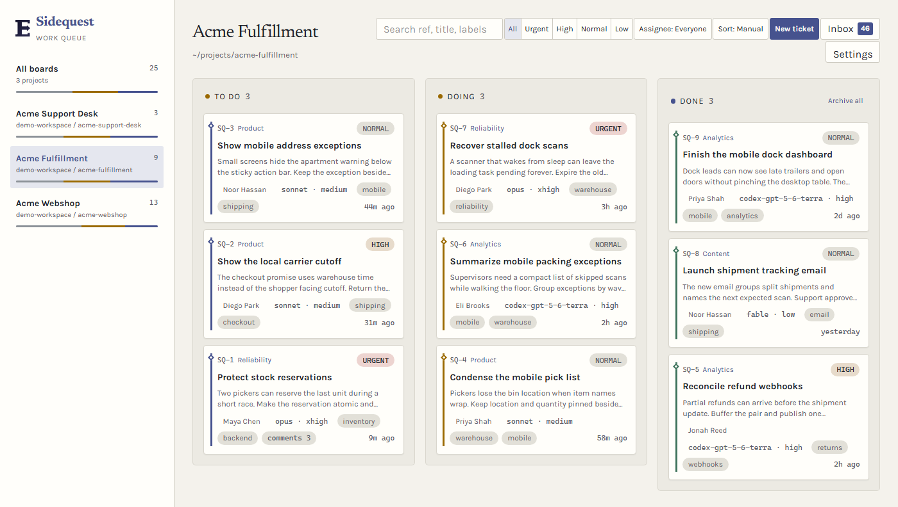
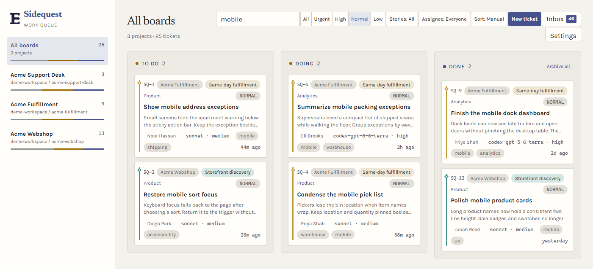
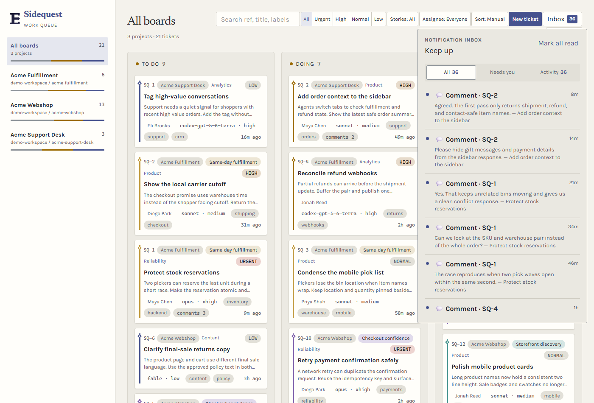
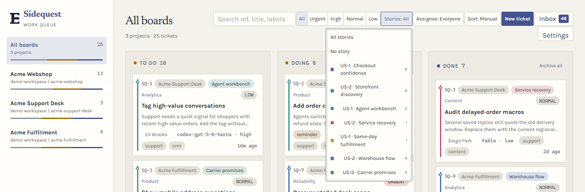
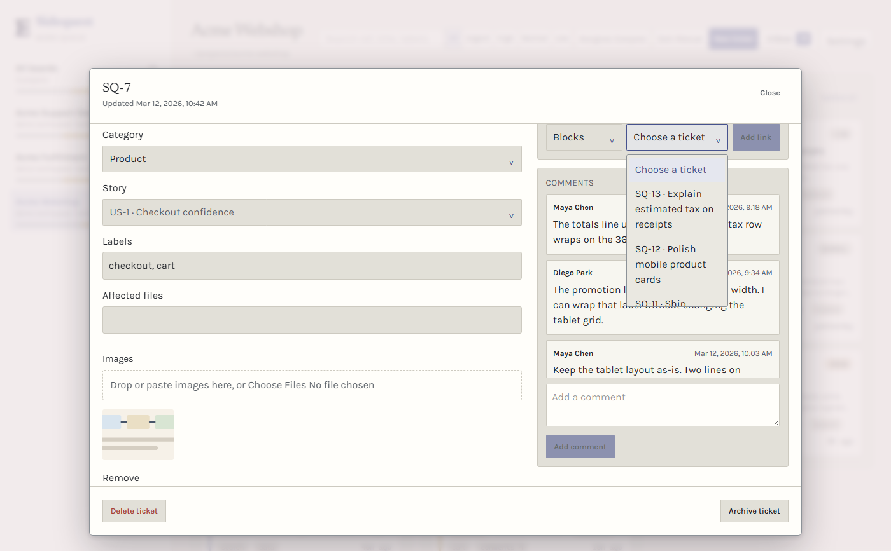
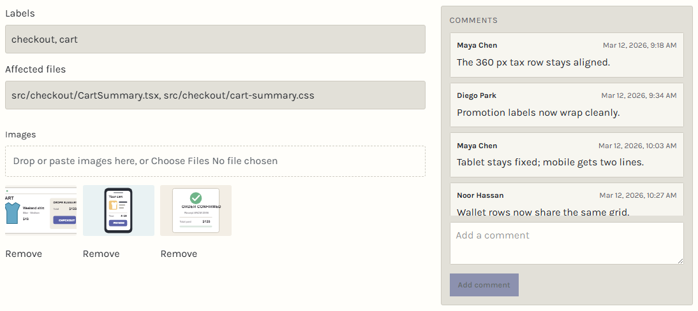
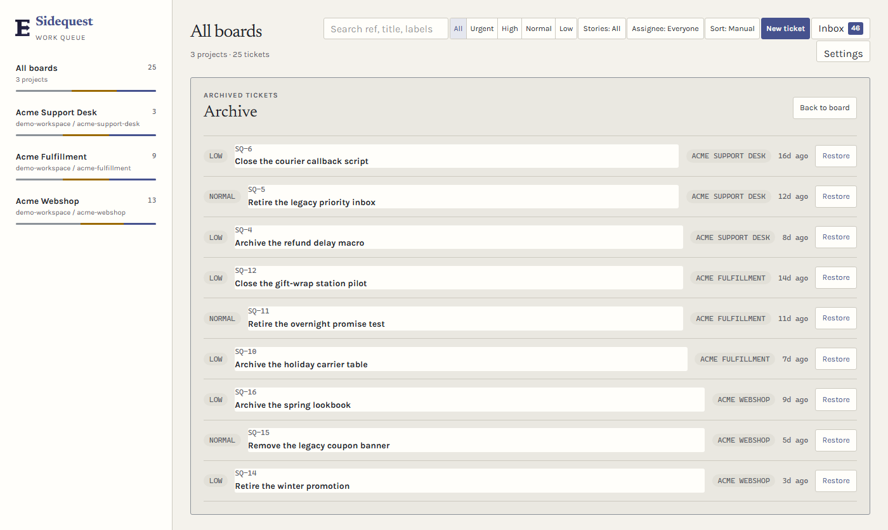
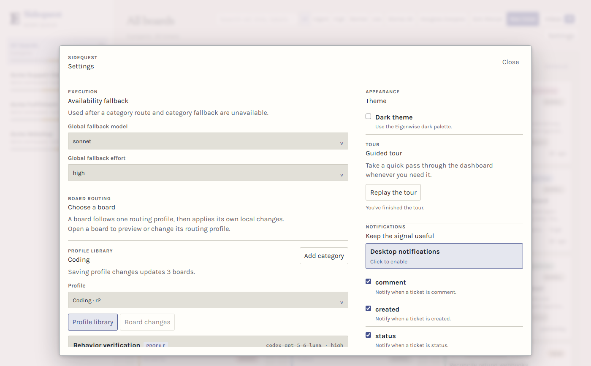

Sidequest gives Claude Code a local board for planned work. It groups tickets into stories, keeps the backlog visible, and runs delegated work through a repeatable review and delivery flow. That flow works for Git codebases and filesystem snapshots of non-Git documentation trees, vaults, and research collections.

## Install

Install Sidequest for the project you are working in:

```text
/plugin marketplace add Eigenwise/eigenwise-toolshed
/plugin install sidequest@eigenwise-toolshed --scope project
```

Reload Claude Code or start a new session after installing. You can also run `/quartermaster:setup` and let Quartermaster install and configure Sidequest for the project.

Sidequest is local. The dashboard runs on your machine and ticket data stays in the local Sidequest store.

## Your first workflow

1. Open the board with `/sidequest:board`, or tell Claude to show your Sidequest board.
2. Describe the outcome you want and ask Claude to plan it as Sidequest work. For example: `Plan the checkout refresh as a Sidequest story and show me the backlog.`
3. Review the proposed tickets, dependencies, and scope in the board. Adjust the plan before work starts.
4. Ask Claude to dispatch the ready tickets. Claude chooses the configured route, starts the work, and reports verification results.
5. When a ticket is ready, ask Claude to review and integrate it if the checks pass. Larger or higher-risk work may need an extra review before integration.

Each ticket carries one verifier: a command suite, document or schema check, review, manual evidence, or attestation. For declared commands, the verifier wrapper binds the completed capture to the ticket, exact command, and candidate revision. A retyped command or prose cannot replace that capture, and a capture from before the final commit must be rerun. Executors cannot replace the verifier with an easier check. Required evidence goes in the dispatch's board-owned directory, not a repository worktree or integration target. A skipped required check needs a bounded human waiver naming the authority, reason, affected gate, and scope or expiry. Before delivery, Sidequest pins the source revision, participants, dependencies, and declared surfaces, then refuses overlapping live sibling work. It rechecks the candidate and final revision during integration, and keeps the delivery evidence, including failures and timeouts.

### Choose the planning depth

Use the lightest planning that fits. Exact small changes and operational asks can stay lightweight. Substantial or ambiguous work starts with a visible surgical contract: the outcome, non-goals, smallest authority needed, scope, bounded oracle (the check that decides whether it worked), and review limit.

Claude asks one batched question round for consequential choices. If the approach is genuinely contested, it may offer bounded agent proposals. `Do your thing`, `use your judgment`, and similar phrases delegate decisions for the current feature or story, not for future work.

Review stays tied to the pinned contract. If two candidate fixes are rejected in the same defect chain, stop patching and replan before trying another candidate.

The board keeps the work visible while Claude and its executors handle the ticket lifecycle. Once a terminal result and its handoff are recorded, Claude retires that executor's native teammate while leaving live claims, retained continuations, and pending integration candidates available for follow-up. Codebase work submits a verified Git range. When Sidequest registers a project outside Git, it persists the `filesystem-snapshot` adapter for that board. A source-revision submission must use that source and the SHA-256 snapshot of the current project tree, plus changed surfaces and review or attestation evidence. The server checks the candidate against the current tree and the persisted dispatch snapshot, then binds those facts to the candidate and its dispatch baseline. CLI and MCP callers cannot provide existence or membership facts. Sidequest records unavailable Git, process, and worktree capabilities instead of probing those adapters.

## Use the dashboard

The project rail keeps every registered board in one place, with ticket counts and status progress beside each project. The combined view is useful when you want to scan ownership, priorities, labels, stories, and routes across the whole queue.


*Synthetic demo data showing three active project boards and 25 tickets.*

Select a project in the rail when you need its focused board. The columns keep that project's open and completed work visible without losing the rest of the rail.



*Synthetic demo data showing nine active Fulfillment tickets across todo, doing, and done.*

The toolbar searches refs, titles, and labels, then combines that query with priority, story, assignee, and sort controls. Active filters stay visible, so you can tell why a card is in the result.



*Synthetic demo data showing six mobile tickets narrowed to normal priority.*

The inbox collects comments, reminders, ticket creation, and status activity across projects. Its tabs separate work that needs you from the wider activity stream.



*Synthetic demo data showing several unread comment notifications from different tickets.*

Open a ticket to edit its fields and read the working context in one place. The detail view keeps a scheduled reminder, dependency links, and the full comment thread beside the ticket fields.


*Synthetic demo data showing the Build cart summary ticket and its team discussion.*

Stories group tickets into a plan you can filter and discuss before dispatch. The toolbar story filter keeps the story list visible while you scan the combined board.



*Synthetic demo data showing the Checkout confidence, Storefront discovery, and fulfillment story groups.*

Links show which tickets block or relate to each other. Use the dependency list to inspect the existing chain, then choose a link type and target when you add another relationship.



*Synthetic demo data showing the existing and newly added dependencies for the Build cart summary ticket.*

The lower ticket context keeps declared files, attachment previews, and the full discussion visible without putting the link picker over the comments.



*Synthetic demo data showing the declared checkout files, visual references, and team decisions attached to the same ticket.*

Completed work can move into the archive without disappearing. The archive view keeps the source board, priority, age, and restore action with each ticket.



*Synthetic demo data showing archived storefront, fulfillment, and support work.*

Settings covers routing profiles, model fallback, theme, notification preferences, and the guided tour. Open it when you need to change how the board behaves rather than the work on a ticket.



*Synthetic demo data behind the Sidequest settings dialog.*

## Daily use

Ask Claude to do the board work in plain language:

- `Show me the Sidequest backlog for this project.`
- `What is ready to dispatch for the checkout story?`
- `Add a ticket for the empty-state bug and include the reproduction steps.`
- `What is blocking SQ-7?`
- `Review and integrate SQ-7 if its verification passed.`

For substantial changes, Claude can turn the request into a story with linked tickets so you can see the whole plan before execution. Side issues that come up during a session can become separate tickets instead of disappearing into the current task.

Claude's persistent Sidequest Monitor runs `sidequest watch --project <path>`. Ticket alerts default to dispatches prepared by the watching Claude session, plus tickets with no attributed owner and terminal dispatches so restart recovery stays visible. GitHub CI alerts always cover the shared repository. After a restart, use `--all` when the new session must follow still-active tickets prepared by the old session; it restores project-wide ticket alerts.

## If something stops working

**The board does not open.** Reload Claude Code after installing Sidequest, then ask Claude to open the board again. If the browser still does not open, ask Claude to start the Sidequest dashboard and report its local URL.

**Claude reports an older loaded Sidequest after an upgrade.** Reload plugins or start a new session to pick up the current connection. Sidequest 4.48.1 and newer can finish compatible dispatches across that version skew, and Claude reports it instead of stopping the current release session. Unknown versions, schema changes, and older loaded versions still refuse dispatch until reload.

**A ticket will not dispatch.** Ask Claude to diagnose the ticket. Common causes are an incomplete work description, a blocked dependency, or an unavailable configured route. Claude reports the specific recovery instead of silently changing the work's route.

**A worktree setup command was incomplete.** Sidequest keeps the completed checkout and shows the command, failure reason, and captured stderr tail in the ticket. The executor runs that command in its assigned worktree before it starts work.

**A worktree-isolated executor cannot write.** Sidequest reserves the exact checkout before Git creates it, then verifies the checkout reported when the executor starts. A copied or similarly named linked worktree has no write authority. Ask Claude to redispatch the ticket if the recorded checkout is missing or does not match.

**Work looks stuck in doing.** Ask Claude to inspect the ticket's current status and executor activity. A running ticket can stay in doing until its verification and delivery steps finish. If the work was merged by hand after an integration conflict, Claude can record the delivered commit and close the ticket with that evidence.

**Stale agent worktrees keep accumulating.** Run `sidequest worktrees status --project <path>` to see the disk use of active worktrees, recovery backups, and quarantine. Session start removes a bounded batch and reports its reached plan, removal, and skipped-by-reason counts if it runs past the hook budget. Ask Claude to run `sidequest worktrees sweep --project <path>` to inspect the rest, then add `--yes` once the rows look right. The dry run includes backups and quarantine entries that will expire after 14 days or beyond the newest three per agent. Clean legacy checkouts with no lease identity are reclaimed only after the minimum age when their revision is reachable from, or patch-equivalent to, the integration branch. Dirty or unintegrated legacy rows stay put with their real dirty, ahead, and age values.

**A ticket contract forbids commits.** Ask Claude to declare it for working-tree delivery before dispatch. Sidequest runs it in the shared checkout, records only the declared changed paths, and requires a final pinned verification capture before it closes.

**A POSIX verify command fails on Windows.** Sidequest runs captures through a POSIX shell when Git for Windows provides one. Each capture records the shell it used. If it falls back to Command Prompt, the capture says so instead of reporting POSIX syntax as a missing toolchain.

**A delivery included a reviewed interaction.** Claude may record the delivered source commit together with one reviewed interaction commit when that interaction descends from the source, stays within the submitted candidate paths, and still passes the assembled-wave and merged-tree gates. If any of those checks fail, ask Claude to inspect the submission instead of treating the interaction as delivered.

**A submitted ticket is not integrated.** Ask Claude to inspect the submission and complete the review and integration step. Do not start the same ticket again while a submitted result is waiting.

**A wave left out a submitted ticket.** MCP wave groups go in one comma-separated `ref` string, such as `SQ-12,SQ-13`; `wave` is the options object, not a list of refs. The assembled acknowledgement names submitted siblings outside the group whose changed paths overlap the selected ticket's scope.

**A submission sat so long it can no longer be integrated.** If the branch has moved far enough that the submitted work no longer merges, there is nothing left to review. Ask Claude to check whether the behavior the ticket asked for is already on the branch. If it is, Claude retires the submission with that evidence and closes the ticket; if it is not, the work needs re-filing against current source. Claude cannot retire a submission whose commit did reach the branch, so this cannot quietly discard work that shipped.

See the [generated Sidequest reference](../../reference/sidequest/) for the agent-facing tool and configuration details, or the [Sidequest plugin README](https://github.com/Eigenwise/eigenwise-toolshed/tree/main/plugins/sidequest) for the project landing page.
