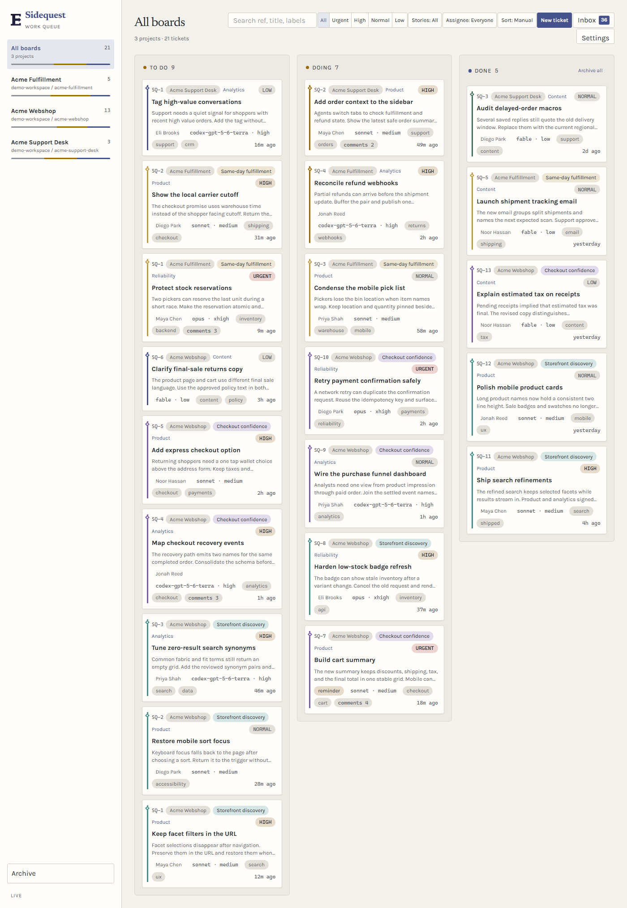
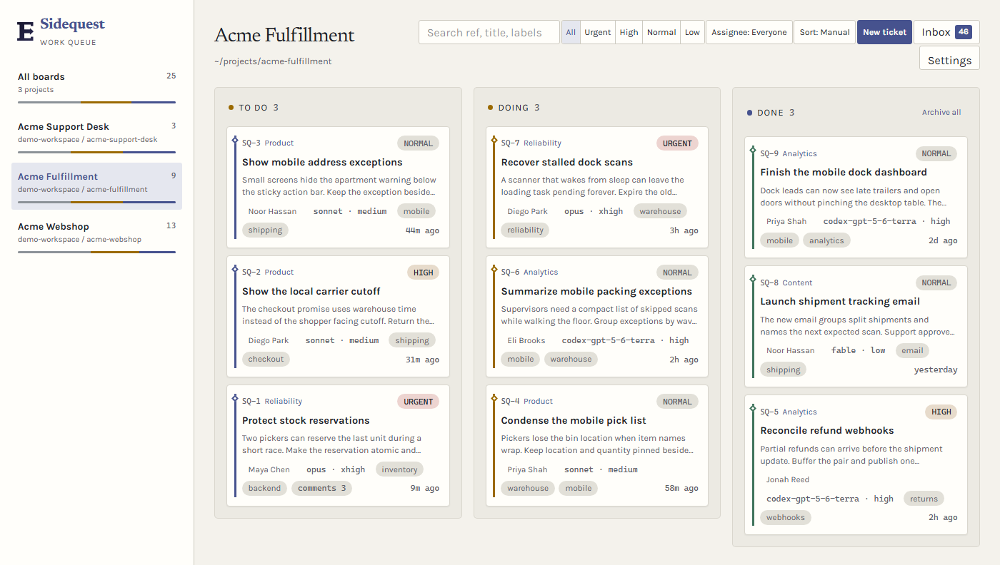
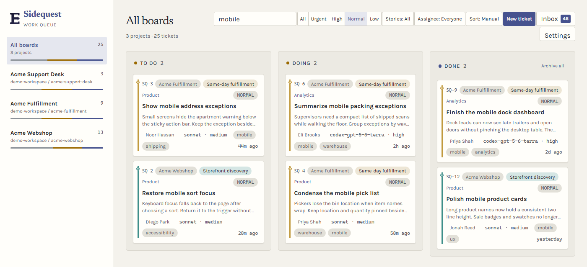
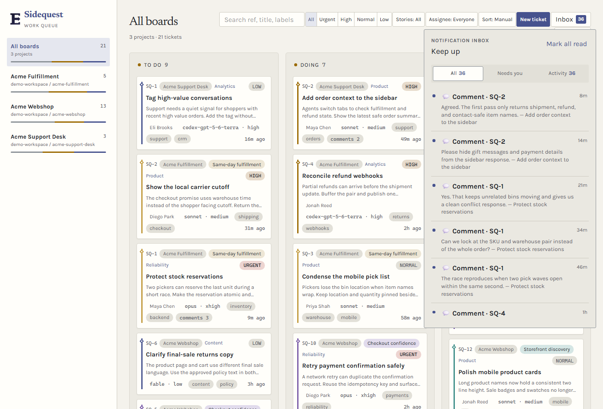
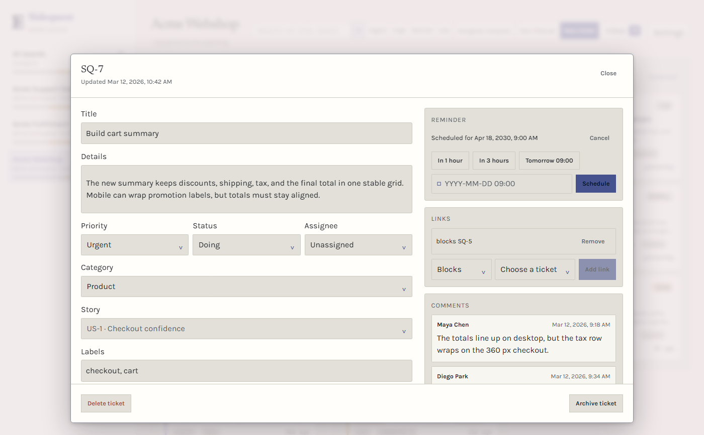
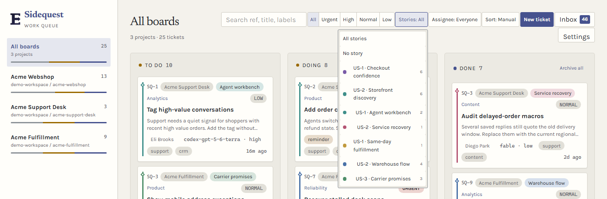
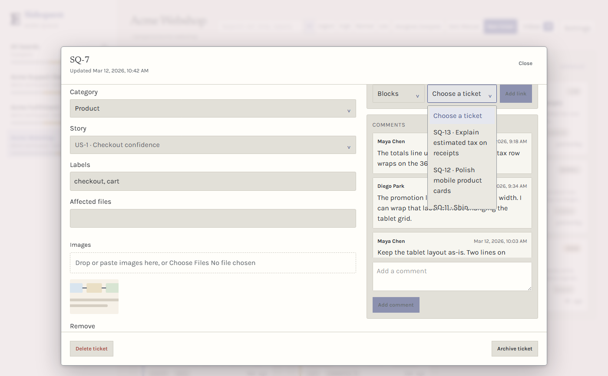
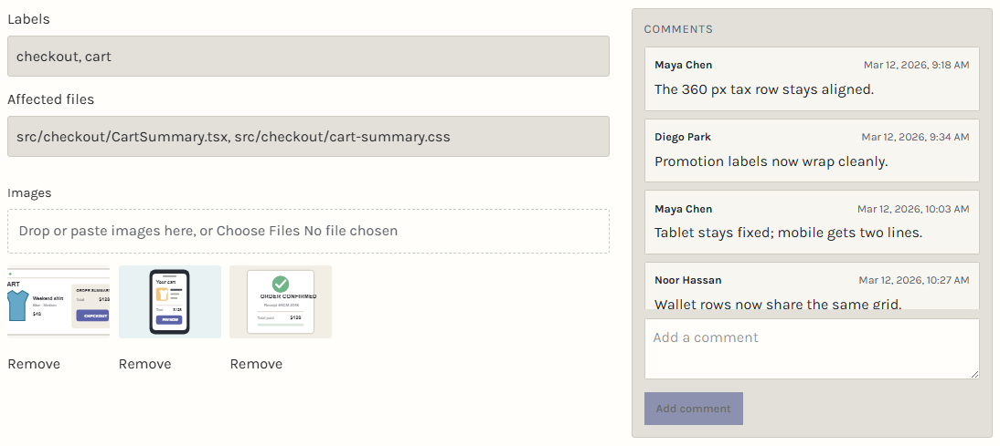
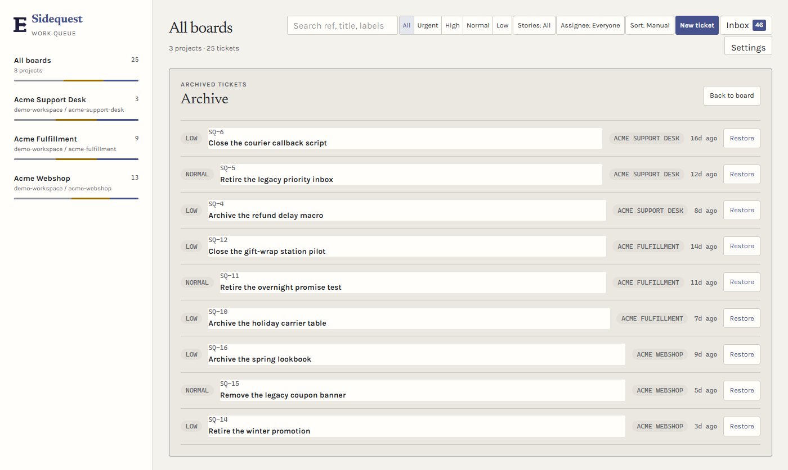
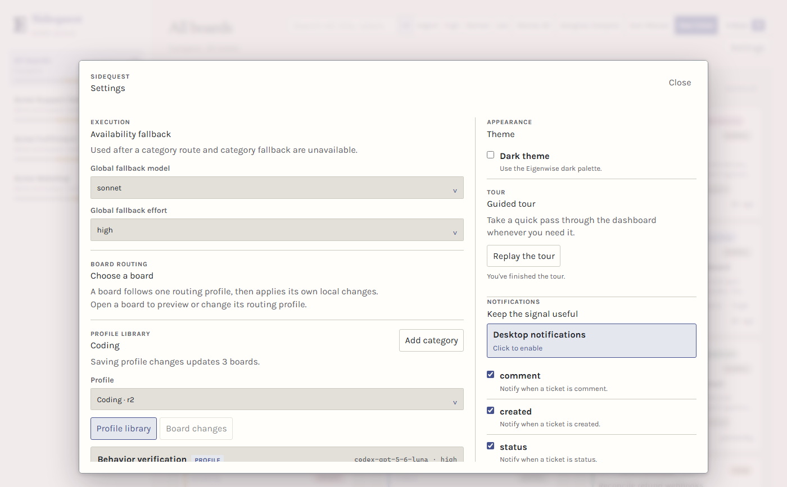

Sidequest gives Claude Code a local board for planned work. It groups tickets into stories, keeps the backlog visible, and runs delegated work through a repeatable review and delivery flow. That flow works for Git codebases and filesystem snapshots of non-Git documentation trees, vaults, and research collections.

Every task saved as a ticket survives context compaction and new sessions. Its instructions, reproduction steps, status, and recorded discussion stay in the local Sidequest store, so Claude can retrieve the task after the chat context shrinks.

## Install

Install Sidequest for the project you are working in:

```text
/plugin marketplace add Eigenwise/eigenwise-toolshed
/plugin install sidequest@eigenwise-toolshed --scope project
```

Reload Claude Code or start a new session after installing. Sidequest packages its executor roster with the plugin, so Claude discovers every routed executor when it loads the plugin, before SessionStart maintenance. You can also run `/quartermaster:setup` and let Quartermaster install and configure Sidequest for the project.

Sidequest is local. The dashboard runs on your machine and ticket data stays in the local Sidequest store.

Each board belongs to one project folder. When you work in a Git repository, Sidequest creates its board the first time Claude uses the board there. A folder that is not a Git repository, such as a notes vault, gets a board only when you name it: ask Claude to add it by its absolute path, or pass `--project <absolute path>` on the command line. Sidequest never makes a board for a missing folder, a folder in your system temp directory, or anything under `~/.claude` (including Sidequest's own storage), and it tells you which rule refused the path. If a registered project's folder is later moved or deleted, the board stays and the projects list marks it as missing so you can archive it yourself.

## Check your first saved task

Start with one small task you actually need to finish. Ask Claude:

> Save this as a Sidequest ticket. Record the result I want, the current progress, decisions, the last check and its result, and one concrete next action. Show me the ticket reference so I can find it again. Keep it on the backlog for now.

Open the ticket and confirm those details are there. If the task has an executable check, record its exact command and last result; put prose acceptance criteria in the description or comments.

Start a new Claude Code session in the same project, then ask:

> Read Sidequest ticket SQ-N and its full recorded discussion. Tell me the saved next action before continuing.

Replace `SQ-N` with the reference Claude gave you. Confirm the answer against the ticket, then ask Claude to continue that action. A detail that was never recorded needs to be supplied again.

Once this save-and-read check works, use the story workflow below when the task needs planning or delegated implementation.

## Your first workflow

1. Open the board with `/sidequest:board`, or tell Claude to show your Sidequest board.
2. Describe the outcome you want and ask Claude to plan it as Sidequest work. For example: `Plan the checkout refresh as a Sidequest story and show me the backlog.` If work belongs on a feature branch, name that branch in the request.
3. Review the proposed tickets, dependencies, and scope in the board. Adjust the plan before work starts.
4. Ask Claude to dispatch the ready tickets. Claude chooses the configured route, starts the work, and reports verification results. Dispatch freezes each ticket's intended target branch, so two concurrent feature branches get separate targets without changing the board default. Integration keeps that recorded target through submission and delivery; a group with different targets stops before changing either branch.
5. When a ticket is ready, ask Claude to integrate it if its checks pass. Independent review is required only for a contract-named seam the check cannot exercise or a required high-stakes review. Multiple review lenses need distinct named risks; wave count alone adds no review.

Each ticket carries a focused check that decides whether its work is ready. Claude records that check against
the final clean committed candidate once and reports what passed, failed, or needs your decision.
Delivery still runs its real pinned verifier. After delivery, Claude runs one combined full merged-tree
gate per wave before versioning, including a singleton. A changed tree after rebase needs a fresh gate.
Assembled-tree proof is reused only when Sidequest's runtime authorizes its exact identities. The agent-facing reference covers capture, evidence, and
delivery mechanics.

Integration always happens in your local checkout: Claude merges the work into the local target branch and
runs the check there. Sidequest never fetches and never pushes, so the push stays a deliberate step you or
Claude take afterwards. When the project has an `origin` remote, Sidequest additionally reads
`origin/<branch>` as evidence about what already landed, which is how it recognizes work that someone merged
outside the board. That only affects what counts as proof; the merge and the check still run locally, and a
recorded delivery always names the branch that actually carried it.

Heavy commands share a named resource slot, within a two-core budget and at most two workers, finite deadlines, and cleanup of
child processes. Other executors keep reading, editing, and committing independently. Once ready to
verify, they record readiness and pause with their claim intact. The actual owner acknowledges that its
command and descendants ended, then the parent explicitly hands the slot to the next holder. A real
terminal closeout or an authenticated mid-claim return can supply that acknowledgement; elapsed time
and process counts cannot. No polling or automatic restart is needed.

On Windows the pinned verify (the verify-capture wrapper), `test:full` and `build:check` run inside a
Job Object. The first run builds a small owner from `scripts/windows-job-owner.cs` with the .NET
Framework `csc.exe` that ships with Windows and caches it per user under the temp directory, keyed by
the source hash, so later runs skip the compile. The owner joins its own job before it creates the
verify command, so the command and every descendant that inherited the job, including ones reparented
away from their parent or started detached, are job members from the instant they exist; a Python, cmd,
pnpm, Turbo chain can't outlive the owner, and killing the owner at any point kills the tree. A process
created through a broker (a service, COM activation, a daemon such as `dockerd` that `docker` asks to
start a container) is outside the job and is not tracked. The deadline (600 s by
default) or a caller `AbortSignal` asks the owner to exit, which reports the job's own list of live
members and closes the job; an owner that does not exit in time is killed, which closes the job just the
same. A pre-aborted signal starts nothing. The capture then fails as `timeout` or `could_not_run`, and
its reason names the processes the job ended, any that refused to end, the broker boundary, and the
output log path. When the owner left no account of its job, or one cut off mid-write or malformed, the
reason says "survivor state unknown" rather than claiming none survived. A host with no `csc.exe` fails the run with `JOB_OWNER_UNAVAILABLE`
instead of running the verify unowned. Set `SIDEQUEST_JOB_AFFINITY_MASK` (for example `3` for two
cores) in the verify's environment to pin the whole job to those processors. POSIX keeps its
process-group supervision unchanged; the signal option does not cancel a POSIX phase.

Handoffs carry the actual instruction or recover it from bounded comments. An exclusive `since` cursor
only says where a read starts; the processed cursor advances after the instructions are consumed.

Tickets should fit implementation plus final verification comfortably before about 75 tool rounds.
Larger work is split along cohesive boundaries. A Continuation checkpoint commits progress, records
remaining work and verification status, and releases for a fresh dispatch. A resource pause keeps the claim.

Quality gates are optional. Run `/quartermaster:setup` and approve the gate proposal to turn one on
through `.claude/quartermaster/crap.json` and a project live rule. Sidequest discovers the configured
gate in the executor briefing; user-injected rules still apply. Without a gate, run the pinned verifier,
state once "no quality gate is configured for this project; Quartermaster setup can add one", and continue.
Gate absence never holds integration or marks work UNVERIFIED.

A configured gate uses the existing local owner: early measured complexity where supported, then trustworthy fresh
coverage for the same candidate bytes. Compatible candidate coverage is reused through the runner's
supported path rather than another full suite. Report per-function rows honestly, with no averages;
untouched legacy functions stay outside scope. Missing analyzer or coverage for a configured gate is UNVERIFIED, and measurement
tooling and reports stay local and uncommitted. The repository's `scripts/quality/crap.mjs` parses with
TypeScript's sync named-pipe API by default; `collectFunctions(text, file, { transport: 'async' })` or
`CRAP_PARSER_TRANSPORT=async` switches to the stdio transport, which also runs under
`node --permission --allow-fs-read=* --allow-child-process`. Before a long measurement run, freeze its inputs and
check source/coverage identity, native ownership and deadline fit. Supported focused real coverage can
run separately from the normal final gate. Source stays fixed during immutable capture; failed or
unsupported measurement stays visible.

### Choose the planning depth

Use the lightest planning that fits. Exact small changes and operational asks can stay lightweight. Substantial or ambiguous work starts with a visible surgical contract: the outcome, non-goals, smallest authority needed, scope, bounded oracle (the check that decides whether it worked), and review limit. Claude settles why an improvement is worth making, its approach, and its boundary before dispatch. Research can supply facts and bounded alternatives. Executors implement that plan with normal local coding judgment and report evidence when a pinned choice cannot work.

For substantial or safety-sensitive changes, Claude first checks feasibility before expensive coding or
tests: shared authority and callers, the smallest existing seam, support for the project's configured quality gate, if any, genuine
native baseline/candidate ownership, a runnable check and its actual timeout/resource fit. Small
deterministic fixes keep one owner and a focused check. A plan advisor is useful only for a named
architectural risk or contested approach worth its cost. Quartermaster handles setup; the dedicated
quality owner supplies measurements.

Ordinary next steps within the pinned contract are preauthorized. One producer owns the patch, focused
regressions, measurement, final capture and submission. A blocked resource or authority decision pauses
that step while unaffected source work continues. Messages carry real decisions and findings, without
routine checkpoint or acknowledgement relays.

Claude lists what the request leaves unclear, sends the unknowns the code can answer to parallel read-only sub-agents, and asks one batched question round only for what that investigation could not settle, with the findings attached to each question. If the approach is genuinely contested, it may offer bounded agent proposals instead. `Do your thing`, `use your judgment`, and similar phrases delegate decisions for the current feature or story, not for future work.

Review stays tied to the pinned contract. If two candidate fixes are rejected in the same defect chain, stop patching and replan before trying another candidate. A bound review and its source cannot be deleted, even with force. Keep the record and create a fresh independently reviewed replacement when needed; deletion does not repair older orphaned records.

The board keeps the work visible while Claude and its executors handle the ticket lifecycle. A Git ticket submits a verified range; a non-Git ticket submits a verified project snapshot. Claude reports any unavailable capability or failed delivery instead of guessing around it.

## Keep tasks through context compaction

Save each task as a ticket with the outcome you want and enough information to pick it up again. As work proceeds, ask Claude to record decisions, progress, verification evidence, and the next action in the ticket description or comments.

> Save this task in Sidequest with the current progress and next steps so we can continue after context compaction.

After compaction or in a new session, ask:

> Check the active Sidequest tickets for this project and continue from their recorded next steps.

The board persists independently of the conversation. Details that matter for resuming the task need to be recorded on the ticket. You can also open its detail view to read the saved fields and discussion yourself.

## Use the dashboard

The project rail keeps every registered board in one place, with ticket counts and status progress beside each project. The combined view is useful when you want to scan ownership, priorities, labels, stories, and routes across the whole queue.



*Synthetic demo data showing three active project boards and 25 tickets.*

Select a project in the rail when you need its focused board. The columns keep that project's open and completed work visible without losing the rest of the rail.



*Synthetic demo data showing nine active Fulfillment tickets across todo, doing, and done.*

The toolbar searches refs, titles, and labels, then combines that query with priority, story, assignee, and sort controls. Active filters stay visible, so you can tell why a card is in the result.



*Synthetic demo data showing six mobile tickets narrowed to normal priority.*

The inbox collects comments, reminders, ticket creation, and status activity across projects. Its tabs separate work that needs you from the wider activity stream. It keeps the newest 200 unread notifications from the last 30 days; set `SIDEQUEST_NOTIFICATIONS_MAX_UNREAD` or `SIDEQUEST_NOTIFICATIONS_MAX_AGE_DAYS` to change either bound.



*Synthetic demo data showing several unread comment notifications from different tickets.*

Open a ticket to edit its fields and read the working context in one place. The detail view keeps a scheduled reminder, dependency links, and the full comment thread beside the ticket fields.



*Synthetic demo data showing the Build cart summary ticket and its team discussion.*

Stories group tickets into a plan you can filter and discuss before dispatch. The toolbar story filter keeps the story list visible while you scan the combined board.



*Synthetic demo data showing the Checkout confidence, Storefront discovery, and fulfillment story groups.*

Links show which tickets block or relate to each other. Use the dependency list to inspect the existing chain, then choose a link type and target when you add another relationship.



*Synthetic demo data showing the existing and newly added dependencies for the Build cart summary ticket.*

The lower ticket context keeps declared files, attachment previews, and the full discussion visible without putting the link picker over the comments.



*Synthetic demo data showing the declared checkout files, visual references, and team decisions attached to the same ticket.*

Completed work can move into the archive without disappearing. The archive view keeps the source board, priority, age, and restore action with each ticket.

A whole board can be archived too (`sidequest archive-board <board>`, or `archive_board` over MCP), for example after a repository moves and gets a new board that numbers its tickets from SQ-1 again. Archiving moves the candidate refs its tickets recorded from `refs/sidequest/SQ-n` to `refs/sidequest-archived/<board>/SQ-n`, so the new board's candidates can't overwrite or build on them; restoring moves them back unless the new board already holds the name. The board's own ref writes, and submit's remedy for a mismatched pin, refuse to repoint a `refs/sidequest/SQ-n` whose commit the ticket never recorded, and name that commit and how to move it aside.



*Synthetic demo data showing archived storefront, fulfillment, and support work.*

Settings covers routing profiles, model fallback, theme, notification preferences, and the guided tour. Open it when you need to change how the board behaves rather than the work on a ticket.



*Synthetic demo data behind the Sidequest settings dialog.*

## Daily use

Ask Claude to do the board work in plain language:

- `Show me the Sidequest backlog for this project.`
- `What is ready to dispatch for the checkout story?`
- `Add a ticket for the empty-state bug and include the reproduction steps.`
- `What is blocking the checkout ticket?`
- `Review and integrate the checkout ticket if its verification passed.`

For substantial changes, Claude can turn the request into a story with linked tickets so you can see the whole plan before execution. Side issues that come up during a session can become separate tickets instead of disappearing into the current task.

Sidequest keeps ticket activity visible in the board. Ask Claude to check active work after a restart or when you need help with a ticket that was started in another session.

An executor can end a turn while still holding its claim. If its board-derived name fails, the original matching Claude session can send one continuation message to the authentic recorded `dispatch.agentId`, or the exact identifier returned by that original Agent launch. A claim holder label is never an address. If the original ID or session is missing or mismatched, continuation stays unverified and the claim/work are preserved. Your **Pause retries** decision stops retries. Queued/resuming messages alone don't prove resumed work; the original executor must actually respond or act. Unknown, completed, absent, or failed-send host results don't prove death or permit takeover. Terminal executors stay stopped. This guidance adds no automatic sends or recovery authority.

Executors share the orchestrator's context window settings. Claude executors run at the full 1M window, and Codex executors are capped at 272k tokens because OpenAI bills input above that at 2x. The `models` tool output and the dashboard's model pickers show each discovered model's window next to it. To change the numbers, see [Context window and cost](../model-gateway/#context-window-and-cost) in the Model Gateway guide.

CI watch alerts exclude completed runs marked `skipped` or `neutral`. Neither conclusion proves that the required checks passed; release verification still needs successful checks on the exact commit.

### When Sidequest speaks up

You don't have to ask for the board. On a project with a working board, Claude is told at session start that it has standing authorization to file tickets and dispatch them for multi-file changes, work at an unknown location, and investigations, without offering first. The first prompt that looks like a work request (a change verb like fix, add, or refactor, or anything longer than a greeting) gets a one-time reminder to ticket and dispatch. If Claude then keeps editing inline, a short nudge tells it to file the ticket and dispatch now. Edits, Bash, and PowerShell commands count toward that nudge; test and build runs (`npm test`, `node --test`, `node -e`, `npm run build`) and plain reads don't. A board call quiets the nudge only until your next prompt. All of this is advice to Claude and never blocks a tool call. Quick one- or two-file edits at a known location, direct questions, and operational requests stay inline.

In a git repository root with no board yet, that first work request gets one line instead: the first `add` creates the board and dispatch works right away through the default profile. Nothing is created until then, and temp folders, the Sidequest home, `~/.claude`, and folders that aren't a git root stay silent.

### Adopting an existing exact composition

If a released root needs to verify an existing commit that combines its own changes with pending source submissions, ask the main Claude thread to adopt that exact composition. Sidequest's MCP `update.admitComposition` records current authority for the immutable commit. It leaves historical checkout ownership unverified, preserves the released dispatch and old proofs, and leaves the source tickets unchanged.

Claude first requests a write-free snapshot, then retries with the root's released generation and each source's exact submission and authoritative review/correction snapshot. Every commit from the original base to the candidate must belong to a complete named source range or to the root's declared own changes. Hidden commits, another ticket's recorded work, changed source state, and root changes outside its original scope refuse adoption.

A new isolated native checkout starts at the candidate; the original base remains the submission floor. The grant belongs to one fresh dispatch, with its own attempt, timestamp, and nonce. Claude still needs ordinary controls, fresh verification output and capture, a full-range submission, independent review of that exact candidate after submission, and normal delivery. A later dispatch cannot replay the consumed grant, and live-claim recovery won't re-mint the root's token either: the executor holding the claim keeps its existing token and checkout. Shared-tree execution and old proof artifacts cannot supply the new verification. The adopted root integrates on its own, never inside a multi-ticket wave, and a source review that changes after the grant blocks its next claim, capture, submit, or delivery.

### Boards in sibling repositories

If you run one session from a parent directory holding several independent repos, each registered as its own board, an executor working a sibling repo's ticket doesn't have to name the board on its lifecycle calls. Sidequest resolves the board from the executor's own binding: a call that carries a `worktree` (commit, submit, checkpoint) is matched to the worktree its dispatch reserved for it, and a call without one (comment, release, done, plan, scope requests) is matched to the claim owner named by `by`. Reads that carry neither, like `pulse`, stay on the session's own board, so the executor briefing tells executors to pass `project` on every call. Nothing else selects a board, so a caller without a claim stays on the session's own board and gets that board's usual refusal. Passing `project` explicitly still wins, and two boards that both fit the same binding are refused by name rather than picked for you.

The parent directory doesn't have to be a git repo. An isolated dispatch's worktree is cut from the ticket's own repository even when the session is rooted in a plain folder. The one case Sidequest can't resolve is a session that holds live isolated dispatches on two boards at once, because the worktree hook is told a session and not a ticket; dispatch refuses that up front and names the other board, so let those finish first.

### Making isolated worktrees buildable

A fresh worktree only has what git checks out. Anything gitignored, like `node_modules`, a `.venv`, or real env files next to their committed `*.example` twins, is missing. The board setting `worktreeDependencyPaths` fills that gap when each worktree is created, and `worktreeSetup` runs one command afterwards. Each entry is `{ path, mode }`, with `path` relative to the repo:

- `copy` copies a file or a directory from your checkout into the worktree. It works on tracked paths too: a copied directory merges into the one git checked out, and any file in it takes the version in your working tree, not the committed one. So `{ "path": "env", "mode": "copy" }` brings in the gitignored `env/api.env` beside the tracked `env/api.env.example`, and `{ "path": "env/api.env", "mode": "copy" }` copies just that file. If you have uncommitted edits to a tracked file under a copied path, the worktree starts with them too.
- `link` points the worktree at your checkout's directory instead of copying it. It only fills a path git leaves absent, so use it for untracked directories like `node_modules`; a tracked path or a single file is refused with a pointer to `copy`.
- A sibling checkout outside the repo, like a Cargo or npm `path` dependency on `../store_rust`, is written `{ "path": "../store_rust", "mode": "link" }`. The link lands beside the worktree, in the worktree root every worktree of this board shares, so the same relative path resolves from inside any of them. It can leave the repo by one level only, and it's never removed with a worktree. `copy` is refused outside the repo, since that copy would be shared and never cleaned up, and absolute paths are refused because every worktree has to find the dependency at the same relative spot.

The wave gate applies the same entries to the checkout it verifies in, except a copy there never overwrites a file the candidates carry.

Some build tools refuse a linked `node_modules`. Next.js 16 builds with Turbopack by default, and Turbopack stops with `Symlink [project]/node_modules is invalid, it points out of the filesystem root` because the link leads outside the worktree. Use `{ "path": "node_modules", "mode": "copy" }` for those projects. On macOS the copy is an APFS clone (`cp -c`), so it takes seconds and shares disk blocks with your checkout; elsewhere, or on a volume that can't clone, it's a plain copy. Links inside the copied directory keep their relative targets, so they still resolve inside the worktree. The sweep counts the copy, links included, as install content and deletes it with the worktree instead of quarantining it.

### Reaping services an executor started

Executors run inside your Claude Code process, so a dev stack or watcher an executor starts in its worktree sees your session's pid as its owner and outlives the executor. When an executor stops, Sidequest writes `sidequest-dispatch.json` into that worktree's private git directory (find it with `git rev-parse --git-path sidequest-dispatch.json` inside the worktree; git never shows it as a change). It holds `ref`, `sessionId`, the executor's own `agentId`, the dispatch `outcome`, `terminalAt`, and `stoppedAt`. A project reaper can tear down a worktree's stack once `terminalAt` is set. A `stoppedAt` with a null `terminalAt` means the executor paused while still holding its claim and may resume, and a stack started after `stoppedAt` belongs to a later run in the same worktree.

A ticket with `workingTreeDelivery` runs in the board's registered checkout, never in a linked worktree. Dispatch's `worktree` argument only names a resumed executor's checkout during live-claim recovery, so passing it anywhere else is refused up front instead of producing a lease the executor can't write through. To deliver from a worktree, drop `workingTreeDelivery` and let the ticket run isolated and submit a commit.

## Read-only reports

Use Sidequest for independent candidate reviews, repository audits, and shortcut debt scans. They use the existing read-only review route and only report findings.

An explicit per-ticket route can use a different provider when the ticket is effectively readonly. It leaves the category route alone; writable tickets stay with their category's provider.

When a category's route can't run right now (ChatGPT sign-in missing, gateway readiness unavailable, the model gone from the catalog), dispatch uses the category's own `fallback`, even when that's a Claude model. The dispatch result's `fallbackReason` and the executor briefing both say which fallback ran and why the primary couldn't, including the gateway's login or setup command. The global fallback never crosses providers, so a Codex category with no fallback of its own is refused with that same reason. A discovered model whose provider isn't served by Model Gateway (anything but Codex or Grok) still runs as its own id, but Claude Code's Agent tool only takes `sonnet`, `opus`, `haiku`, or `fable` as a model. So Sidequest writes executor definitions named `sidequest-exec-model-<slug>-<effort>` (plus `-readonly-model-` twins) into your user agents folder, each pinning the full id, and spawns them with no model. Only the model and effort pairs some category route or fallback actually uses (on any board on this machine) get a file, and the `-readonly-model-` twin only exists for readonly categories. Session start writes those and removes the rest, so changing a route swaps the files. A dispatch that routes somewhere no category does, like a ticket route override, writes its own file right before the spawn. Your own agent files are never touched.

- An explicitly assigned readonly advisor can discuss a bounded architectural/feasibility question directly
  with its builder through available native messaging and inspect authorized source snapshots while
  implementation and tests proceed. Its ticket names paths, limits and budget; findings record the
  actual inspected hashes. Moving-draft advice never accepts a candidate or releases ownership. Claude
  selects a suitable live category without changing profiles and reports missing messaging/category
  support. This does not permit arbitrary source peeking or self-review.
- A candidate review starts from the submitted ticket and its immutable candidate, never a working tree.
  Ask Claude to bind the review to that submission. Final review reuses byte-identical inspected material,
  checks the settled delta, unresolved findings and real execution identities, and consumes genuine
  compatible capture evidence without rerunning a suite merely for reviewer identity. Existing exact
  candidate and independent-review guards still decide acceptance.
- A repository audit names the directory or subsystem to inspect. It reports concrete delete, reuse, standard-library, native-platform, YAGNI, and shrinking opportunities with source locations. It does not edit code.
- A shortcut debt scan reads source comments, including `whittle:` markers. Each result gives the file and line, known ceiling, observable upgrade trigger, and replacement. A missing ceiling or trigger remains a finding.

These read-only reports work independently. If Sidequest is not installed in the host, Claude reports that the routed capability is unavailable. Observability can show absolute measurements, though gain stays unmeasured without a matched baseline. Static headline figures and private workflow data do not prove a gain.

Read-only executors run in your session's own permission mode. They don't ask for `bypassPermissions`, and Claude Code ignores `permissionMode` in plugin agent files anyway. They keep Bash so a review can run the suite, but Sidequest refuses the shell write forms inside the checkout they run in: redirects like `echo x > file`, `rm`, `mv`, `touch`, `tee`, `sed -i`, and git commands that change the repository. Scratch files and evidence go outside the checkout. That guard reads the command text, so a script can still write; if you need a hard boundary, keep your session out of bypass mode.

### Denying tools to executors

Ask Claude to set `deniedTools` on the board (`board_config`) or on one category (`category_edit`). It takes tool names like `Agent` or `WebFetch`, or an MCP server prefix like `mcp__claude-in-chrome` for every tool on that server. Any executor on that board, or working a ticket in that category, gets refused those tools when it calls them, write executors included. `readOnlyDeniedTools` still applies to read-only executors only. The Sidequest board tools can't be denied, since executors need them to claim and close. The denial happens at call time, so the tool's schema still sits in the executor's context.

## If something stops working

**The board does not open.** Reload Claude Code after installing Sidequest, then ask Claude to open the board again. If the browser still does not open, ask Claude to start the Sidequest dashboard and report its local URL.

**Claude reports an older loaded Sidequest after an upgrade.** Reload plugins or start a new session to pick up the current connection and packaged executor roster. Unknown versions, schema changes, and incompatible older loaded versions refuse dispatch until reload.

**A plain Agent spawn is refused.** Sidequest denies generic Agents in favor of ticket executors, and the refusal says what it found. If it says the project has no install, dispatch would refuse too: run `claude plugin install sidequest@eigenwise-toolshed --scope project` from that project, then reload plugins. "No Board MCP server has recorded itself" or "has exited" (with its pid) means the board server really is gone for this session: run `/mcp` and reconnect `plugin:sidequest:board`, or restart Claude Code. A new session id from `/clear`, a resume, or compaction does not count, because the server records itself by process and project. The same server also follows the new id for dispatch and every other board call, reading it from the record Claude Code keeps for its own process, so you don't need to reload plugins after `/clear`. If the liveness markers can't be read, the refusal says the state is unknown rather than down.

**A session gets no Sidequest briefing at start.** Only an orchestrator gets one: a session whose project has a registered board. A project with no board, or a session launched as a Sidequest executor (`--agent sidequest-exec-*` or `SIDEQUEST_AGENT`), gets no orchestrator block, though sweep and reload notices still show. The first board call registers the project, so the next session is briefed. `SIDEQUEST_NUDGE=off` still silences it everywhere.

**Claude says an executor is missing.** Update Sidequest, reload plugins in the affected session, and ask Claude to dispatch again. Do not create replacement agents or disable the dispatch guard.

**Claude's Agent tool rejects `name` or `mode`.** Ask Claude to inspect the Agent schema it can see, then use Sidequest's reduced-schema dispatch only when those two fields are absent. Sidequest keeps the board label separately and refuses the first claim unless the host hook reports the real agent identity and a permission mode the executor can actually finish under, which is `auto` or `bypassPermissions`. A reduced-schema executor inherits the mode of the session that spawned it, so this is a fact about your host, not a setting to change: if it reports something else, use a host that reports one of those two instead of adding unsupported fields or editing your permissions.

**A ticket will not dispatch.** Ask Claude to diagnose the ticket. Common causes are an incomplete work description, a blocked dependency, or an unavailable configured route. Claude reports the specific recovery instead of silently changing the work's route. A refused dispatch leaves the ticket's current token working, so the executor that already holds it keeps running: Sidequest only replaces the token once the new dispatch is saved. For a non-Git project it also captures the filesystem snapshot before the final checks, and a project registration change rejects that capture rather than recording it. That snapshot is bounded by a path count, a byte total, and a wall clock, and it refuses with the limit it hit instead of hanging. The walk never counts `.git`, `node_modules`, `.next`, `dist`, `build`, `target`, `.venv`, `vendor`, or what the root `.gitignore` excludes, and a cap refusal names what it skipped and which top-level folders held the paths it did count. A deadline refusal names the file it was reading when the clock ran out, which is the whole diagnostic when a sync client or network share is the thing blocking. A board registered before its folder (or a parent) became a Git repository moves to the Git adapter on its next dispatch, and that dispatch's warnings say so. A third dispatch after two durable terminal no-commit rounds is blocked by default, on the theory that an unreadable environment reproduces the same failure every time; overriding it takes an explicit `allowRepeatFailure` (CLI `--allow-repeat-failure`), and taking that override is recorded on the ticket.

**A dispatch or release says the ticket changed while it was reading checkouts.** Dispatch and release run their Git checks under the ticket's own lock, before they take the board database's write lock, so a slow `git status` in one project can't stall writes everywhere else. They then re-read the ticket and only write if nothing moved. If something did, nothing was written: read the ticket again and retry if it still applies. Those two writes also refuse to start a child process or wait on any lock file while they hold the write lock. If one ever tries, it fails with `WriteLockHeldError` and rolls back, which is a Sidequest bug to report rather than something to retry. A retired checkout is only removed after the new dispatch is saved, and right before removing it Sidequest checks again: if a commit landed in it or its branch moved since the dispatch looked, the checkout and branch stay. If the removal fails the dispatch still stands and its warnings name the checkout that was left in place; if the checkout went but deleting its branch failed, the warning says the branch was kept. The next dispatch checks it again.

**An executor died before it ever claimed its ticket.** An API error at launch, a refused first claim, a failed or cancelled worktree setup, or an Agent call that came back without a claim all leave the same thing behind: a dispatch nobody holds. There's no claim to release and nothing for TaskStop to stop. Tell Claude what the host reported. The session that spawned the executor retires the dead attempt right away with that failure text as recovery evidence, then dispatches a fresh one or closes the ticket. A different session, say after a restart, can't see the failure, so it waits out the retirement deadline the refusal prints (15 minutes after the last sign of life, or the hour-long backstop while worktree setup never finished). If the stop hook already marked the attempt failed, the same request just prepares the replacement.

**Work landed but the ticket won't close.** When an executor released (for example as a technical blocker or a handback) and you committed or cherry-picked its change yourself, there's no submission for `integrate` or `done` to consume. Close it with `groomClose` and the landed commit as the delivery commit, delivery method manual, once that commit is on the recorded integration branch. For a cherry-pick, that's the cherry-picked commit, not the executor's original.

**An unscoped executor could only write `docs/`.** Older builds gave a write ticket with no declared files, dispatched with `allowUnscoped`, only the board's `alwaysInScope` paths, so a repo with a `docs/` folder quietly scoped the executor to `docs/` and nothing else. Now `allowUnscoped` gives the executor the whole tree, and the dispatch result's `writeScope` and the briefing say so in one line, for example `write scope: unscoped (whole tree), always-in-scope: docs/`. A whole-tree scope needs an isolated worktree, so an unscoped dispatch that would run in the shared checkout is refused at dispatch; declare the paths the ticket needs instead.

**A legitimate recursive delete gets refused.** Sidequest blocks a Bash or PowerShell command that recursively deletes the user profile or the `.claude` root, even inside a real cleanup. A home-relative target such as `~/repos/app/build` or `$HOME/repos/app/build` is judged by where it resolves, the same as its absolute spelling, so only the profile, `.claude`, or a parent of either is refused. Point the delete at a specific project or scratchpad path instead.

**A read-only ticket cannot start in a new repository.** Claude reports the checkout choice and keeps the ticket read-only. You do not need to commit notes or change board settings.

**A worktree-isolated executor cannot write.** Ask Claude to redispatch if the recorded checkout is missing or does not match the assigned checkout. Executors launched together can each be recorded against the other's checkout, whatever their executor types. The claim corrects this: when an executor claims with its own dispatch token from inside its checkout, its ticket is leased to that checkout, and the claim result names the corrected path. The claim does not move a checkout that a sibling has already claimed. If both siblings already claimed, the orchestrator can still correct each ticket. It dispatches with `recoveryEvidence`, `claimHolder`, and the executor's real `worktree`. When the two claims were launched together, hold exactly each other's checkouts, and neither checkout has another ticket's commits, the rebind swaps the two records, so both executors can write. Otherwise the rebind is refused while another live ticket holds the checkout and the checkout's HEAD is not this claim's own commit, and the refusal says to release the ticket with kind `handback`. A release made from the executor's own checkout keeps that checkout for the next dispatch. A redispatch never resumes a retained checkout whose commits belong to another ticket. It gets a fresh checkout instead. An executor that stops before it claims never ends a live sibling's ticket: while a sibling launched with it has not claimed yet, Sidequest waits for that claim before it marks the stopped executor's ticket failed. The same holds when an executor's checkout creation fails, or when Claude retires an unclaimed executor with recovery evidence: while a worktree-isolated sibling launched with it on the same board has not claimed, no checkout is removed and the sibling's ticket stays claimable, and the sibling's claim is still leased to the checkout it runs in.

**An executor reports that its checkout is not the one its ticket is bound to.** When one of the two checkouts belongs to another live claim, commit, submit and the verification wrapper refuse and name that other ticket and its claim holder, rather than sending the executor into a tree a different agent is working in. Nothing the board diffs in the bound tree would be this ticket's work, so treat the refusal as a crossed binding. The fix is the rebind described above: when the two claims were launched together and hold exactly each other's checkouts with neither carrying another ticket's commits, that rebind swaps the two records onto their own checkouts at once, with nothing to commit first. Otherwise, the executor commits its work in the checkout it runs in and pins that commit at `refs/sidequest/<ref>`, so the checkout's HEAD is its claim's own commit. Then Claude rebinds the live claim to that checkout with `recoveryEvidence`, `claimHolder`, and `worktree`. If the executor has no exact crossing to swap and no commit to pin, or the rebind is refused, the executor releases the ticket as a technical blocker with any commit hash recorded. Claude then redispatches the ticket onto a checkout of its own and salvages that commit by hash. A start callback for a checkout a live claim already occupies is refused the same way, so a second executor is never handed an occupied tree. Retiring or recovering a crossed attempt also never removes a checkout that another live claim references. That checkout stays with the live claim, and the replacement attempt gets a checkout of its own.

**A ticket's project is a different repository from the current session.** An isolated dispatch now cuts its own worktree from the ticket's project and verifies there, not from the session's checkout, so this works across repositories. It only refuses when the same session already has isolated dispatches open on two different projects at once; that case names the conflict and the remedy.

**Work looks stuck in doing.** Ask Claude to inspect the ticket's current status and executor activity. Sidequest keeps the intended integration branch that was frozen at dispatch, even if you later change branches or the board default. For two feature branches, name the intended target on each ticket instead of changing that board-wide default between dispatches. A read-only ticket in an isolated worktree also honors an explicit board base of `local-main` or `origin-main`; the automatic base deliberately stays on the checkout that prepared it. A bound review still starts from its candidate commit.

**A ticketed helper is refused while writing verification evidence.** Only the ticket's active owner and helpers admitted through that owner's recorded identity can write the ticket's exact board-owned evidence directory. Helpers cannot use another ticket's folder or a lookalike path. Ask Claude to inspect the ticket binding, not to request repository scope.

**A submit names a dirty path the ticket never declared.** A dispatch enforces more than the ticket's files: its own release fragment, tracked build outputs paired with declared sources, and the board's `alwaysInScope` paths (`docs/` by default when the repo has one). The dispatch result lists those as `boardAddedFiles` and the executor briefing lists them under their own headings, so you can tell a board-added path from a declared one. A board path that already holds one of the ticket's declared files is left out: a ticket declaring `docs/tools.md` gets that file, not all of `docs/`. To stop a board path being added at all, change `alwaysInScope` in the board config.

**Scope requests are answered differently for two tickets.** A scope request is auto-approved when the path sits in the same package surface (the first folder under a package root, like `src` in `plugins/sidequest/src`) as a file declared by any ticket in the same story, so two story members asking for the same path get the same answer. A ticket outside a story uses only its own files. Protected paths (manifests, CI, release, credentials) and globs are never auto-approved. A refusal comment says why each path missed, for example `package surface frontend/apps/web/lib matches no declared file in this ticket's story`.

**A declared file outside the repository is refused.** A ticket that declares an absolute path outside the repo for non-repo output can write that exact path; the write guard matches it as declared. `scopeRequest` still refuses paths outside the repo, so declare them on the ticket instead.

**Stale agent worktrees keep accumulating.** Ask Claude to inspect local worktree storage and clean up entries it can safely remove. Storage is reported per directory with a total, so a directory quietly growing to tens of gigabytes is visible. A manual sweep reports each candidate while it classifies it, including its count and skip reason, and can walk every registered project in one run instead of only the one you have open. Cleanup classifies in this order: `status_unknown` keeps; `tracked_changes` keeps; `ticket_closed_settled` removes a tree whose ticket is done, archived, removed, or released, whose cleanup lease is granted (an unknown, replaced, unregistered, locked, or live checkout goes on to the reasons below instead), and whose HEAD is on the integration branch, in `refs/sidequest/<ref>` (never for a released ticket, whose continuation resumes there), or at its dispatch base, at any age and even while it holds gitignored build output such as `.next`, `coverage`, `node_modules`, or `tsconfig.tsbuildinfo`, as long as git lists every ignored entry as a file; a tracked change keeps it, and an untracked file that is not ignored or a gitignored nested repository sends it on to the reasons below; `too_young` keeps for 3 hours; `upstream_ambiguous` or `upstream_unavailable` keeps; `untracked_recent` keeps, while `untracked_quarantined` moves a tree holding untracked or ignored content older than 7 days whole into quarantine; `ticket_archived`, `ticket_done`, `branch_reachable`, and `patch_equivalent` remove; `commits_on_branch` removes the tree and retains its branch; `not_integrated_salvage` salvages work older than 7 days; then `not_integrated` keeps. Quarantined work is parked for 14 days and removed on age alone; nothing younger is ever deleted, and entries under a live claim are kept. Nothing is deleted where it stands: a reclaimed tree is renamed into quarantine, and content that was there when the sweep classified it, or that arrives before the move, parks the whole tree. A tree counts as clean only when its status carries nothing untracked or ignored (ignored content counts, including a gitignored nested repository; the one exception is installed files under an ignored `node_modules`, which worktree setup regenerates, including one reached through a link that resolves inside the tree, such as the `node_modules/.bin` entries an install writes, and every link inside a `node_modules` that `worktreeDependencyPaths` copied in; outside such a copy, a link under `node_modules` that escapes the tree, a directory entry reached directly rather than through a link, and a nested repository all still count as data); anything else stays in quarantine. The moved copy is re-read once before its files are deleted, so a file written into it in the instant after that read is deleted with it. A commit on the worktree's own branch is not lost: the branch is deleted only with `update-ref -d refs/heads/<branch> <tip>` against the tip re-read at that destination, so a commit landed on it after that read leaves the branch retained as `tip_moved`. That compare is by value, so a ref moved away and then back to the same tip is not detected. A detached checkout is never reclaimed on ticket status alone: before its tree is touched, and again at the quarantine destination, the sweep asks the main checkout whether another ref already contains that HEAD, counting neither the checkout's own private metadata, nor a per-worktree ref (`refs/worktree/`, `refs/bisect/`, `refs/rewritten/`) of the checkout doing the asking, nor any branch this sweep could still delete, which includes every `worktree-agent` branch the orphan pass may take once the reclaims are done; a probe that cannot answer keeps the tree, and so does a branch listing it cannot read. A HEAD no other ref holds keeps its checkout where it stands as `detached_head_unpinned`, and one whose ref disappears mid-reclaim parks the moved tree: the park runs `git worktree repair` against the quarantine destination, so the parked tree keeps a working HEAD and its commit stays in `rev-list --all` after the prune. A repair that cannot be confirmed withholds every repository prune until a later sweep repairs every retained park, and is reported as a failure, leaving both the files and the registration they came from intact. Expiry removes quarantine files with link-safe filesystem deletion; only after retained parks reconcile does Git's metadata-only prune remove their registrations, otherwise that metadata cleanup is reported as deferred. A review's detached checkout still reclaims normally, because its candidate is pinned by `refs/sidequest/<ref>`. The limit is a commit made on a detached HEAD after those reads. On Windows a process still holding the tree open makes the rename fail and the tree stays in place until a later pass, and quarantine lives under the Sidequest home, so a worktree on a different volume is never reclaimed and parks as `quarantine_failed` every pass until the quarantine directory is on the same volume. The move itself never follows a dependency link, and the links it carried are released at the quarantine destination afterwards, which never deletes what they point at. Every ticket close reclaims that ticket's worktree in the same command, at zero age: `sidequest integrate`, `groom-close --integration`, and the MCP integrate, groomClose, done, release, and remove tools. A done or release sent by the executor that still holds the live claim leaves its own tree for the next session sweep, because that executor is still running inside it. A tree classified `ticket_closed_settled` is judged from git's own listing, so it costs one status read instead of a check on every ignored file; its moved copy is re-read by that same rule. Git status is read four trees at a time with a 60-second limit per tree, so a read that hangs marks only that tree `status_unknown`, and the sweep counts the timeouts. A bounded sweep takes closed-ticket trees first, then the oldest. SessionEnd hands the sweep to a detached process and returns at once. SessionStart, SessionEnd, and each ticket close share one sweep lock, and a sweep that finds the lock held skips its pass and leaves the trees to the sweep that holds it. `worktrees sweep` ends with the count per reason and the wall time. The generated reference has the lifecycle and recovery details.

**A ticket contract forbids commits.** Ask Claude to declare working-tree delivery before dispatch. Command and suite requirements close after the matching final capture. Commandless document, link, schema, custom, manual, and attestation requirements close with explicit typed evidence. The declared edits stay uncommitted and unpushed in the shared checkout for your normal team handoff. Ticket closure records that handoff; it does not replace your project's commit, review, or push process. A sibling's active allocation is ignored only when both dispatches record the same nonempty preparing session, their claims overlap, and their scopes are disjoint. Before dirty-path classification, Sidequest validates every eligible completed sibling's recorded candidate against its recorded paths and current content. A mismatch stops closeout, so preserve the shared-tree work and hand it back to the existing parent for verification or grooming. Do not revert it or expand scope to absorb it.

**A POSIX verify command fails on Windows.** Ask Claude to inspect the recorded verification result and the shell it used. On Windows a verify command runs through Git for Windows `sh.exe` when it's installed, unless it names an unquoted backslash path like `cd C:\repo\app` or `cd plugins\app`: `sh.exe` would strip those backslashes, so that command runs through Command Prompt instead, verbatim. The capture records which shell ran. Forward-slash paths and quoted backslash paths (`"C:\tools\node.exe" -e "..."`) stay on `sh.exe`, which keeps backslashes inside quotes. Command Prompt's `cd` doesn't switch drives, so a verifier on another drive should use `verifyCwd` instead of a `cd`.

**A verify command needs to run from a subdirectory.** A nested workspace (its own `Cargo.toml`, `package.json`, or Nx root) only checks the right code when its gate runs from that directory. Set `verifyCwd` on the ticket (`--verify-cwd` on the CLI) to a path relative to the project root, like `plugins/app`. The verify-capture wrapper runs the command from that directory of the checkout, the integrate gate does the same, and the board checks npm scripts and paths in the command against it. Unset, the command runs from the project root as before. A `verifyCwd` that's absolute or climbs out with `..` is refused.

**A verify command that can't run never counts as passed.** A command the shell can't find (exit 127) records `toolchain_missing`, and a shell that never started records `could_not_run` with the spawn error. When you add or update a ticket, the board refuses a verify whose first word isn't a known tool, a shell builtin, a path, or something on `PATH`.

**The verify-capture wrapper refuses with `verification_capture_command_mismatch`.** The briefing's wrapper line only names the project and ticket, and the wrapper loads the pinned verify command from the ticket itself, so there's nothing to copy by hand. An older briefing still carries the command as a `--base64` blob. When that blob doesn't match the ticket's pinned command (one mistyped character is enough), the wrapper runs nothing and prints both commands. Rerun it without `--base64`.

**Submit refuses a ticket you claimed directly with `verification_capture_required`.** A direct claim has no dispatch briefing, so nothing handed you the wrapper line. The refusal prints it: `node "<plugin>/lib/verify-capture.js" --project "<project>" --ticket "<ref>"`. Run it from the checkout holding the committed candidate, then submit again. It runs the ticket's current verify, so an `update` to the verify after an earlier dispatch is what gets checked, not that dispatch's old command. A capture recorded during the earlier dispatch doesn't count for your claim.

**Verification fails before any edit.** The active claim holder can record `[sidequest:verify-complete] failed: <evidence>` or `[sidequest:verify-complete] could_not_run: <evidence>` before touching the repository. That preserves the failure report only. A passing completion, submit, or done still needs the declared scoped work and required verification.

**A delivered ticket's verify command no longer runs.** Ask Claude to record a passing replacement verifier; Sidequest keeps the original requirement and its evidence on the ticket alongside the replacement.

**A submitted ticket is not integrated.** Ask Claude to inspect the submission and complete the review and integration step. Do not start the same ticket again while a submitted result is waiting.

**A wave left out submitted work.** Ask Claude to inspect the assembled wave and its declared participant set. Active or accepted pending candidates with overlapping scope belong in the wave. Review-rejected candidates stay visible for later supersession and do not block an accepted repair wave.

**A wave gate fails, or passes, and you want to know what it actually ran against.** When a group's participants pin a verify command, the gate runs that command itself, in a temporary checkout of the wave baseline with every candidate merged in. It never runs in the project root or in one candidate's worktree. The command sees your normal environment minus the `CLAUDE_PLUGIN_*` variables the board server inherits from Claude Code, so a project suite can't mistake the Sidequest plugin folder for its own. The gate result records `verifiedTree`, the Git tree it checked, and the checkout is removed afterwards. Candidates that don't merge cleanly refuse with `assembled_wave_compose_failed` and nobody gets rejected: assemble a set that merges.

**Overlapping candidates use different pinned checks.** Checks the wave gate never runs (document, link, manual, attestation, review) only have to be the same kind, so a batch of notes that each pin their own document check still goes out as one wave. Different commands, or a command mixed with a document check, can't. For those, Claude keeps the checks and candidate identities frozen, composes the exact accepted candidates in the registered target, runs every pinned check and the full composed gate, then records each verified delivery manually. This is a control-plane `groomClose` with the immutable candidate as `deliveryCommit` and `deliveryMethod: "manual"`, without `integration: true`, which is only for a matching delivered wave. Missing candidate content, a skipped review or check, and substituting current `HEAD` all refuse.

**A repair was delivered with `apply`, and closing the rejected submission it replaces keeps refusing.** `apply` puts the delivered changes in your working tree instead of a commit, so the board has no committed tree to prove the replaced paths against. Commit that tree unchanged on the recorded target branch, then ask Claude to bind it: a `groomClose` on the already-closed repair with that commit as `deliveryCommit`. Sidequest re-runs the merged-tree check and refuses a commit that is unreachable from the target or whose tree differs from the reviewed candidate on any submitted path. A refusal, including a failing check, leaves the recorded delivery alone, so the same commit can be bound again once the cause is fixed. After that, superseding the rejected submission needs replacement evidence only for the paths the repair really changed. Do not claim untouched paths as replacements to get past the refusal.

**A candidate was rebased or squash-merged before it landed.** Its files no longer match the candidate byte for byte, and later merges keep moving them, so a plain manual delivery refuses for missing content. Ask Claude to record the delivery against the landed revision it can name — a merge commit, or whatever the upstream flow produced — and Sidequest proves every submitted path at that revision instead of your working tree: the same content, a deletion the revision also carries, or the candidate's own change reverse-applying onto it. Anything left over still refuses, and closes only once Claude names those paths as resolved by hand and the closure reason carries that evidence. A revision older than the candidate's own starting point is refused outright, because it cannot hold the landing, and naming resolved paths on a candidate the branch already contains is refused too rather than quietly ignored. The record keeps the per-path proof.

**Integration stops on a merge conflict.** Sidequest never resolves a conflict itself. It aborts, puts the target back, and names the recovery: merge the candidate into the target branch by hand, resolve the conflict, commit the merge, re-run the checks, then ask Claude to record it. That is a `groomClose` with the merge commit as `deliveryCommit` and `deliveryMethod: "manual"`. Keep the candidate as a parent of that merge, because that ancestry is what proves the candidate's content landed. A squash or cherry-pick of the resolution drops it and is refused.

**A candidate landed through a squash merge, and closing it says it never landed.** A squash gives the work a new commit, so the candidate itself is never an ancestor of the target. Ask Claude to record the squash commit as the delivery: a `groomClose` with that commit as `deliveryCommit`. It records when the squash carries exactly the candidate's changes, whether the candidate was one commit or several. A squash that also carries another ticket's changes still refuses. Leave that ticket open rather than closing it with `abandonSubmission`, which records work that shipped as never landed.

**`integrate` refuses `branch_not_checked_out` after you switched branches.** Dispatch records the integration branch it saw. If you fast-forwarded another branch to it (say main to develop) and stayed there, delivery now goes onto the branch you have checked out, because it contains the recorded one. To deliver onto the checked-out branch on purpose, pass `integrationBranch` (CLI `--integration-branch`). A checkout that neither matches nor descends from the recorded branch still refuses, and the refusal names both branches.

**`integrate` refuses `integration_target_dirty`.** Only dirt the delivery would collide with blocks it: a modified or untracked file at a path the delivery writes (the old name of a file it renames counts), or anything staged or mid-merge. The refusal names just those paths and says how many other dirty paths were fine to leave. Commit, stash, or remove the named ones and retry. Files a running service keeps rewriting, like logs or JSON state, can stay as they are when the delivery doesn't touch them: the merge goes around them, and a rollback after a failed gate leaves them alone too. They're listed as `ignoredDirtyPaths` on the delivery.

**A replay delivery stopped on a conflict.** Resolve it by merging the pinned candidate commit itself into the target, not by cherry-picking it, fix the conflict in that merge commit, and re-run your checks. Then ask Claude to record it with `integrate` and that candidate as `deliveryCommit`. A hand-resolved cherry-pick always refuses, because its content no longer matches the candidate. The refusal message names the exact commit to merge.

**A reviewed follow-up renamed a file the candidate added.** Recording the delivery with that follow-up as `deliveryInteractionCommit` accepts the rename: a renamed submitted path counts as inside the candidate, under both its old and new name. The follow-up still may not touch any path the candidate never submitted.

**A multi-commit candidate's release fragment sits in an earlier commit.** Closing it by its tip commit reads the fragment from the whole submitted range, the same range `submit` already accepted, so it no longer refuses `missing_release_fragment`.

**A verdict approved a candidate you meant to reject.** A bound review's outcome describes the candidate: `accepted` approves it, `rejected` confirms it must not ship, and `inconclusive` approves nothing. Ask the main Claude thread to correct a mistaken finalized accepted with MCP `verdict.correct`. The review must be readonly and finalized, both review and source must be unclaimed and terminal, and the original source submission must still be pending. Delivered or superseded sources refuse correction.

Claude reads the original timestamp from `list({ref: reviewRef}).ticket.oracle.verdict.at` and supplies `outcome: "rejected"`, audit `by`, nonempty correction `text`, optional `why`, and `correct: {expectedOutcome: "accepted", expectedVerdictAt, sourceRef, evidence, commit}`. A non-Git candidate uses `sourceRevision: {source, value}` instead of `commit`; provide exactly one. `constraint` is not accepted for corrections. The timestamp is the original verdict's `at`, never a later comment or correction timestamp.

The correction appends an audit and comment, preserves the original verdict, completion, experiment log, and candidate, and rejects both binding halves at the same correction timestamp. An exact retry writes nothing, including after an authorized main session reload; conflicting rationale or evidence refuses. A retained repair may then submit its full range, but still needs its own independent review and normal delivery checks. Authority follows Sidequest's trusted main-thread MCP/store grant and host-hook caller class, with the actual runtime session required. `by` only records provenance. This boundary does not prove cryptographic actor origin; subagents, CLI, dashboard, and ungranted store calls cannot grant themselves correction authority.

**Integration stops because the work already landed on the remote.** Your local target branch is behind a commit that already contains the candidate, usually because someone merged it outside the board. Sidequest refuses instead of merging, and it does not move your branch, fetch, or run the check. For a group, it checks every participant before touching anything, so nothing is half delivered. Fetch and bring the local branch forward yourself, then ask Claude to retry the closure.

**A submission sat so long it can no longer be integrated.** Ask Claude to check whether the requested behavior already reached the intended branch. If it did, Claude records that evidence; if it did not, the work needs a fresh ticket against current source.

## Support

Optional, if Sidequest saves you time: [Ko-fi](https://ko-fi.com/eigenwise) or [GitHub Sponsors](https://github.com/sponsors/Eigenwise).

See the [generated Sidequest reference](../../reference/sidequest/) for agent-facing tool and configuration details, or the [Sidequest plugin README](https://github.com/Eigenwise/eigenwise-toolshed/tree/main/plugins/sidequest) for the project landing page.
