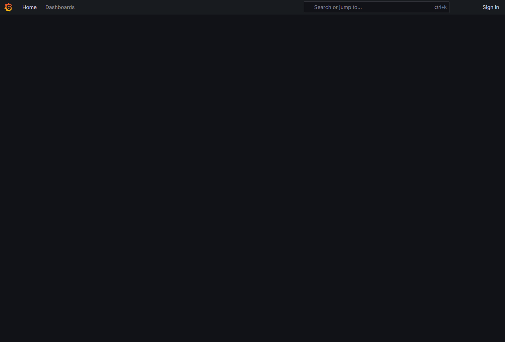
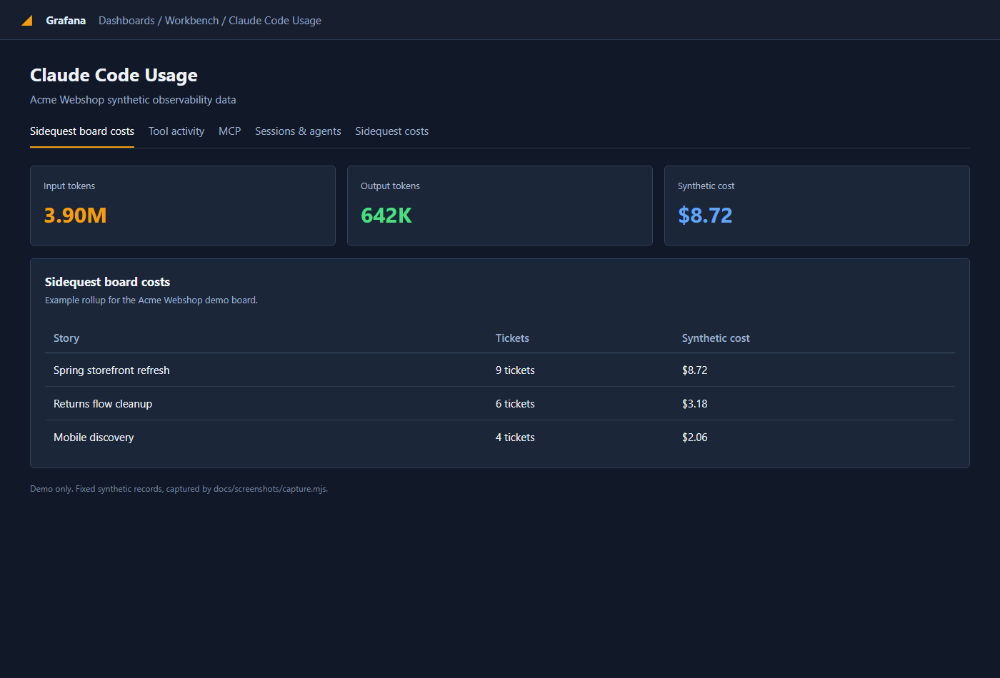
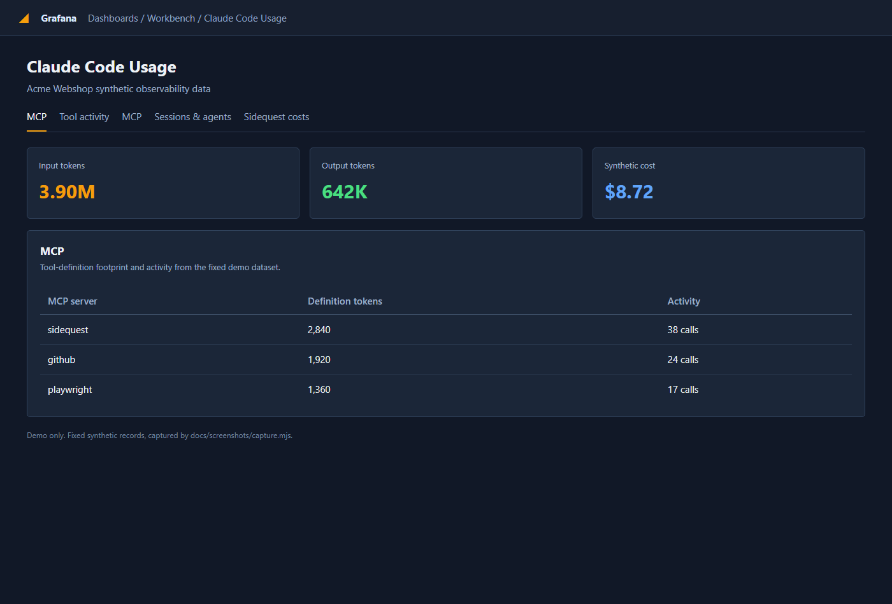

The dashboard reads local telemetry from enabled projects. Use the project filter for one codebase, or the global view for a cross-project picture.

## Read the panels

Token panels split input, output, cache creation, and cache reads. Input and output usually dominate active work. Cache reads are still useful context consumption, but their cost weight is different, so compare both token count and the cost estimate.

The model view shows which model routes are doing the work. The gateway view separates requests sent through Codex Gateway from direct Claude API activity. The “who is burning” view helps find projects, sessions, or models with the largest totals.

These are counts and derived cost estimates from local records. They are for finding patterns, not billing statements.
