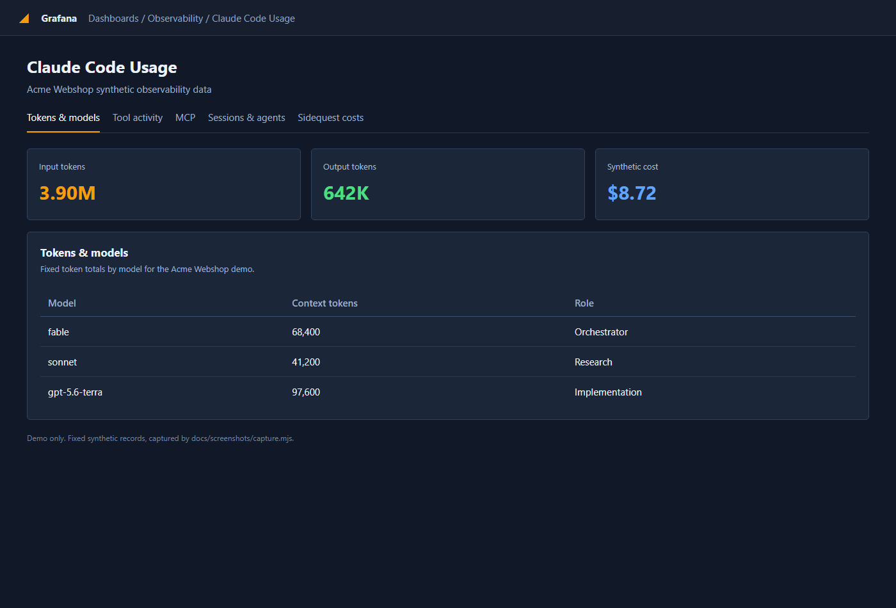
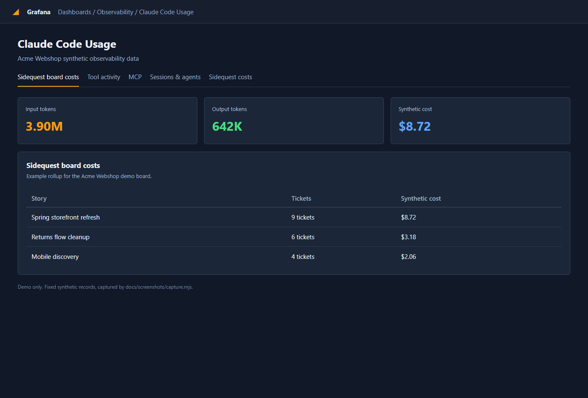
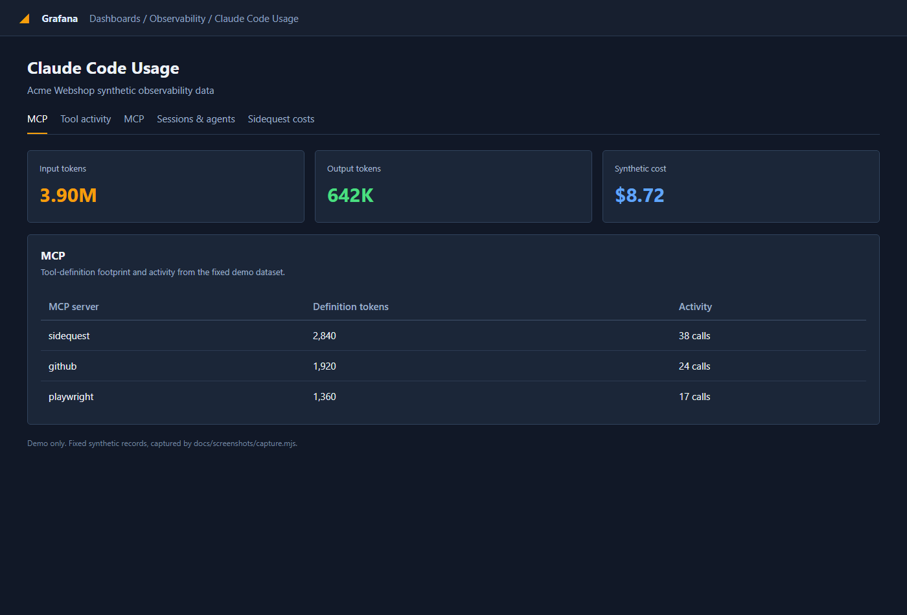

The dashboard reads local telemetry from enabled projects. Use the project filter for one codebase, or the global view for a cross-project picture.

## Board routing

Sidequest boards show their selected routing profile, revision, category count, and local-change badge. The Board routing panel lets you choose a profile and preview a repoint before applying it. The preview calls out changed, missing, and added categories, ADD collisions, foreign-base rows, and prepared dispatches that will be superseded. Local rows keep their provenance, so pins and board-only categories remain visible after a profile change.

## Profile library

The Profile library lets you inspect and edit profile categories. Its header shows how many boards follow the profile, and a save explains how many boards receive the update. Rows carry Profile, Override, Pinned, Board-only, or Disabled badges. Retired profiles stay hidden unless you ask to include them. The global availability fallback remains above the profile controls.

Token panels split input, output, cache creation, and cache reads. The token cards are raw token counts. The USD card and the cost-by-token-type breakdown are API-equivalent estimates for the selected time range.

## Reading over-time panels

Use the **Bucket** dropdown to change the aggregation window. It is a Grafana dropdown, not a row of buttons. Choose `1m` for close investigation or `1h` and above for an overview. Every stacked bar is one bucket's total, split by its series, so bar height remains the combined total.

**Cost over time, by model** prices each token type separately from the local model-price table. It is a list-price equivalent for comparing work across model routes, not a bill. Models without a table entry appear under **Unpriced model usage** instead of being treated as free.

## Efficiency

- **Context spent per answer token (lower is better)** shows input and cache tokens processed for every output token. Fresh executors normally use less context than the long-running orchestrator. A widening gap means the orchestrator is waking up with too much context.
- **Work moved off the Anthropic limit** is the share of list-price-equivalent work routed through codex-gateway to Codex models. Higher means the second subscription pool is doing more work. The dollar figures are comparisons, not charges.
- **Background/compaction cost by model and project** ranks compaction, summaries, and other auxiliary work. A small amount is normal. Bursts are overhead rather than task output.

MCP connection activity counts connection attempts by server and status. Claude Code names only plugin-hosted servers on that event, so IDE and user-configured servers are grouped as “unnamed (non-plugin server)” instead of being dropped. That event carries no project, so the panel is board-wide and shows up on the global dashboard only, not on the per-project ones.

These are counts and derived cost estimates from local records. They are for finding patterns, not billing statements.
