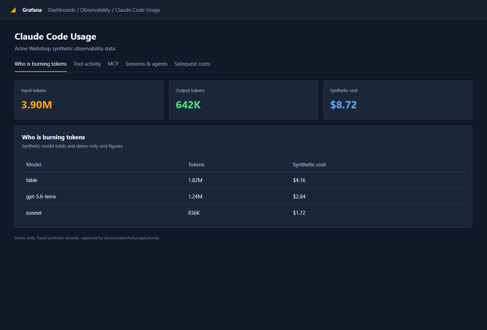

After setup, open the configured loopback dashboard. The default URL is `http://127.0.0.1:3000`. The global **Claude Code Usage** view compares all opted-in repositories. A project view filters the same signals to one repository.

A project appears after Claude Code metrics arrive for it. Restart sessions after opt-in, create activity, and allow the first records to arrive before treating an empty project view as a failure.

## Start with the main views

Use the dashboard to answer three practical questions:

- Which models and projects account for token use and estimated cost?
- Which tools and MCP servers are active?
- Which Sidequest stories are consuming the most work?

The global view also includes total spend, work routed to Codex, tool failure rate, hook and gateway failures, source activity, and context recharge. Choose a smaller time bucket for investigation, then use the legend or data inspection view for exact series values.

The screenshots below use fixed synthetic records from the documentation capture pipeline. They show the shape of the views without exposing a real project, session, or cost record.

The **Tokens & models** view helps compare model usage and the role attached to each series.

The **Who is burning tokens** view makes the largest model totals easy to find before you change routing or prompts.

The **MCP** view separates server definition footprint from call activity.

The **Sidequest board costs** view rolls usage up by story so a board can be compared with the work it represents.

## If a view is missing

- **The dashboard does not open:** tell Claude the local Observability dashboard is unavailable and ask it to diagnose the setup.
- **A project is missing:** restart sessions in that repository, create activity, then ask Claude to verify project telemetry.
- **The project says `not-found`:** run the same skill with an audit request. Claude checks which session directories are wired and tells you what needs a restart or repair.
- **The dashboard has no recent data:** check the selected time range and whether the source cards have received records in the last few minutes.

Resetting a generated dashboard does not disable telemetry or delete local history. Ask Claude to repair or reset it when the dashboard definition is stale.

See the generated [Observability reference](../reference/observability/) for the dashboard and verification details.
