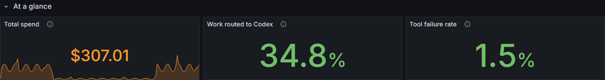
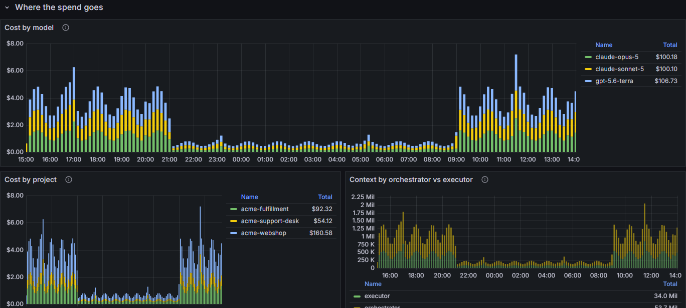
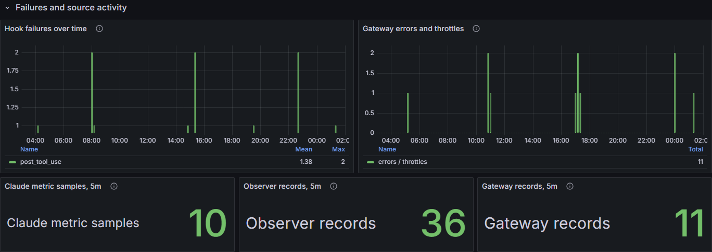
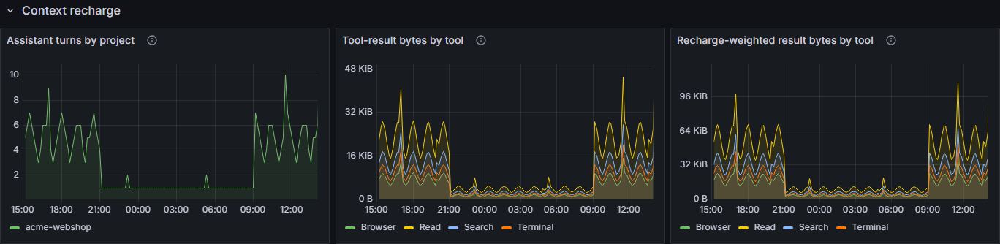

After setup, open the configured loopback dashboard. The default URL is `http://127.0.0.1:3000`. The global **Claude Code Usage** view compares all opted-in repositories. A project view filters the same signals to one repository.

A project appears after Claude Code metrics arrive for it. Restart sessions after opt-in, create activity, and allow the first records to arrive before treating an empty project view as a failure. Environment changes need a full process restart, not only `/reload-plugins`.

## Start with the main views

Use the dashboard to answer three practical questions:

- Which models and projects account for token use and estimated cost?
- Which tools and MCP servers are active?
- Which Sidequest stories are consuming the most work?

The global view is organized into four rows: **At a glance**, **Where the spend goes**, **Failures and source activity**, and **Context recharge**. It includes total spend, work routed to Codex, tool failure rate, hook and gateway failures, source activity, and context recharge. Choose a smaller time bucket for investigation, then use the legend or data inspection view for exact series values.

The screenshots below use fixed synthetic records from the documentation capture pipeline. They show the shape of the views without exposing a real project, session, or cost record.

The **At a glance** row gives a quick read on model usage, roles, spend, and failures.

The **Where the spend goes** row breaks down model totals and API list-price-equivalent cost before you change routing or prompts. Those dollar figures are estimates, not subscription charges. Pricing comes from the maintained model/provider price map and its linked public authorities, including [Anthropic pricing](https://platform.claude.com/docs/en/pricing) and [OpenAI API pricing](https://openai.com/api/pricing/). Cache buckets follow the resolved provider's semantics. **Unpriced model token usage** keeps models without a maintained public API price visible by resolved model name and provider-reported token volume, while the cost panels leave them out. The **Work routed to Codex** percentage uses resolved Codex API-equivalent cost divided by total priced API-equivalent cost in the selected range, so it is not a token share or subscription-spend measure.

The **Failures and source activity** row shows hook and gateway failures alongside source activity.

The **Context recharge** row shows context-related activity alongside the rest of the global usage signals.

## If a view is missing

- **The dashboard does not open:** tell Claude the local Observability dashboard is unavailable and ask it to diagnose the setup.
- **A project is missing:** restart sessions in that repository, create activity, then ask Claude to verify project telemetry.
- **The project says `not-found`:** run the same skill with an audit request. Claude checks which session directories are wired and tells you what needs a restart or repair.
- **The dashboard has no recent data:** check the selected time range and whether the source cards have received records in the last few minutes.
- **A model disappears after an Observability update:** ask Claude to compare the live panel query with the newest installed dashboard template before repairing it. The newest running observer owns the managed version record, so an older open session leaves newer dashboard files alone even when a downstream health check is failing.

Resetting generated dashboards with `--reset-dashboards` does not disable telemetry or delete local history. After a reset, create fresh activity, run setup or let SessionStart reprovision the dashboards, fully reload the Grafana browser tab, and then verify. Grafana Refresh reruns queries already loaded in the page, so it does not replace a stale dashboard definition. Report `found` or `not-found` honestly.

See the generated [Observability reference](../../reference/observability/) for the dashboard and verification details.
