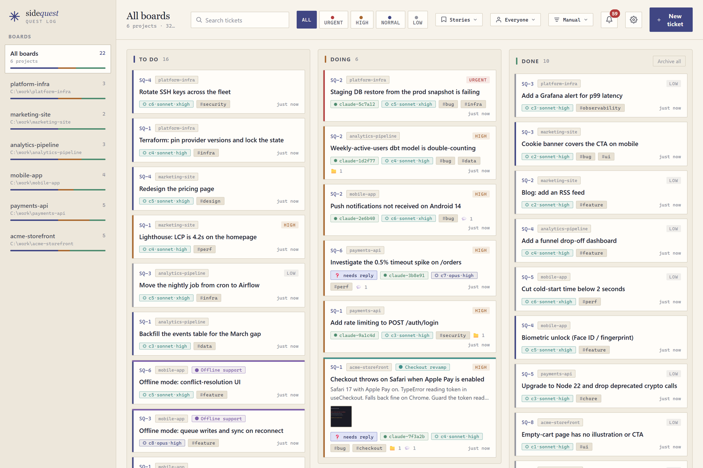
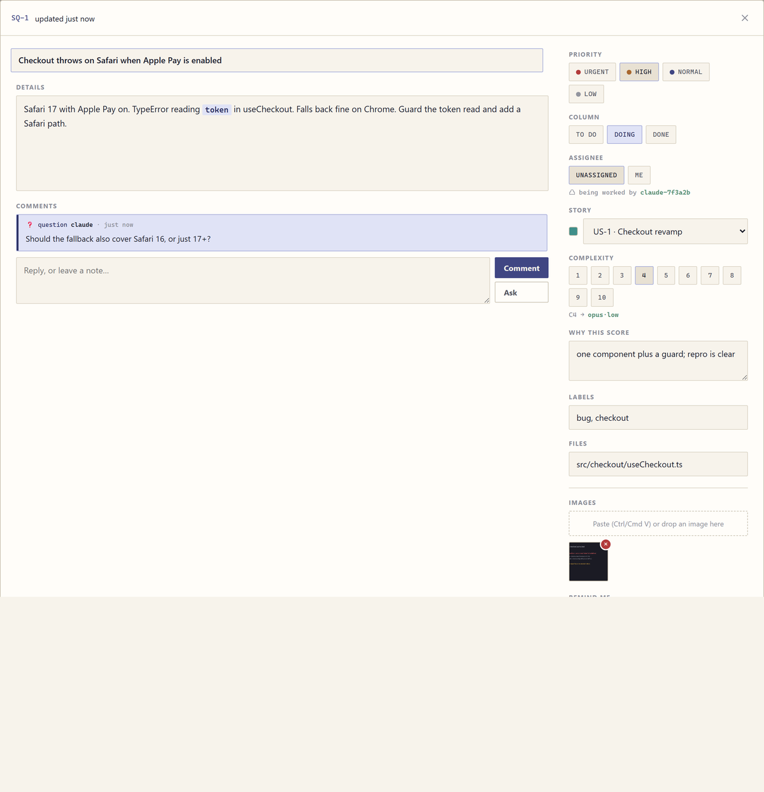
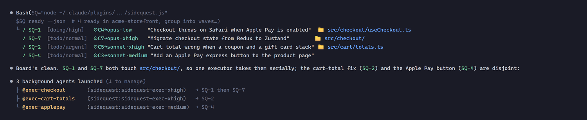

# sidequest

# ⚠️ UNDER HEAVY CONSTRUCTION

**Sidequest is changing quickly and may break, reroute work unexpectedly, or require migration between releases. Don't rely on it for critical unattended work yet.**

[](.claude-plugin/plugin.json)
[](https://claude.com/claude-code)
[](../../LICENSE)
[](https://github.com/sponsors/Eigenwise)
[](https://ko-fi.com/eigenwise)
[](https://discord.gg/J3W9b5AZJR)

*Part of the [eigenwise-toolshed](../../README.md), a small marketplace of Claude Code plugins by [Eigenwise](https://eigenwise.io).*

**A Trello-light quest log for Claude Code.** The stray issues you mention while Claude is busy with
something else — *"oh, and the contact form doesn't send"* — get captured as **tickets** on the spot,
with any image you pasted attached, and land on a **live, self-hosted Kanban dashboard** that spans
every project you work in.

You stay on your main quest; the side quests get written down.



*One live board across every project you work in. It's completely local: the server binds to `127.0.0.1`, nothing phones home, and there's no hosted version. Free and MIT.*

## Install

```text
/plugin marketplace add Eigenwise/eigenwise-toolshed
/plugin install sidequest@eigenwise-toolshed
```

Then run `/reload-plugins` (or restart Claude Code). No dependencies, no build step — it's Node stdlib
only (Claude Code already ships Node), cross-platform.

## The idea

You're deep in a CSS fix. You say *"oh and the checkout throws on Safari."* Normally that either
derails the current task or gets forgotten three messages later. sidequest does neither:

1. The **Sidequest skill** keeps filing side issues in scope without interrupting the work in progress.
2. Claude files the ticket directly with the MCP `add` tool (or the CLI): title, description, priority,
   labels, and any **pasted image**, then the main task keeps moving.
3. The ticket appears on your **board**. Ask *"show me the dashboard"* and it opens in your browser,
   live-updating as new tickets land.

Nothing leaves your machine. The board server binds to `127.0.0.1` only.

## Capturing side issues

The Sidequest skill tells Claude to file a separate issue directly as a ticket and keep going. It carries
the developer-to-developer detail available, while a thin issue can stay thin. Filing a ticket never asks
Claude to work it.

- **Pasted images become attachments.** Paste a screenshot with your message and Claude carries it into
  the ticket; you'll see the thumbnail on the card and full-size in the board's lightbox.
- **It doesn't derail the current task.** Claude makes one MCP `add` call (or a single quick CLI call),
  then continues what it was doing.

You can also just ask directly: *"make a ticket for the flaky signup test, high priority."*

## The dashboard

Ask *"show me the dashboard"*, *"open the board"*, or run **`/sidequest:board`**. Claude starts the
local server (idempotently — it reuses one that's already running) and opens your browser.

- **Live.** The board polls every ~2.5s, so tickets added from anywhere (the CLI, MCP,
  another window) show up on their own and animate in — no refresh. It only re-renders when something
  actually changed, pauses polling while its browser tab is in the background, and refreshes instantly
  the moment you switch back to it.
- **Every project at once.** The left rail is a switcher across all your boards, plus an **All boards**
  view. Because tickets are stored centrally (not inside each repo), one dashboard covers every folder
  you work in simultaneously.
- **Manage by hand.** Drag cards between **To do / Doing / Done**, click a card to edit title,
  description, priority, labels, and images, paste or drop new screenshots, or delete it. Filter by
  priority and search across everything.

It's a self-contained page — no CDN, no fonts, no network calls beyond its own local API.



*Click any card to open the ticket: priority, status, assignee, story, category, files, comments, reminders, and links.*

### Notifications and the bell inbox

When **Claude** changes the board while you're working elsewhere, sidequest tells you — but it never
nags you about your own edits. Notifications live in a small **persistent queue on the server**, not
just in the open tab, so they survive a reload and pile up even while no dashboard is open.

- **The bell is an inbox.** Click it to open a readable list of what happened — questions, comments,
  new tickets, status changes — newest first, each linking straight to its ticket. It's split into
  **Needs you** (questions Claude is waiting on + your reminders) and **Activity** (new tickets, moves,
  comments) so a question never gets buried in routine noise. A gold badge on the bell shows the unread
  count — it turns **red** when any unread is a question waiting on your reply; click a notification (or
  **mark all read**) to clear it.
- **Sidebar unread badge.** Each project also shows a small gold badge counting the tickets Claude
  created or moved between columns since you last opened that board. Open the board and the badge
  clears. Changes *you* make in the dashboard (in any tab) never raise a badge or an inbox entry.
- **Desktop notification.** Toggle this from the **gear** menu ("Desktop notifications") — when Claude
  does something in the background and you're not looking at the dashboard, you get a native toast on
  top of the inbox entry. Click it to jump straight to that board.
- **Choose what pings you.** The gear menu lets you pick which events notify (and queue): **questions**,
  **comments**, **new tickets**, **status changes** — each a toggle, honored server-side so an opted-out
  kind never queues even with no tab open. A question from Claude is the one you'll usually want on,
  since it means Claude is waiting on your answer.
- **Mute a whole project.** The gear menu also has a per-project switch — turn a board off and it queues
  **nothing**, of any kind, regardless of the toggles above; its row in the sidebar shows a muted-bell
  mark. Handy for a chatty background project you don't want pinging you while you focus elsewhere.

The distinction is by origin: a change made through the dashboard is *you*; a change made by the CLI or
a subagent is *Claude*. Only the latter notifies, badges, or queues. (While a board's tab is fully
backgrounded, the browser throttles its timers, so a desktop toast can lag a little; the inbox itself
doesn't need the tab open at all.)

## User stories

Bigger than a single ticket? Group the pieces under a **user story**. Every ticket in a story is
**color-coded** to it on the board, so a multi-part feature reads as one arc instead of scattered cards.
Claude decides on its own whether an incoming request is a standalone ticket or a story-with-tickets
(and files it accordingly) — you can also drive it by hand.

```bash
sidequest story add -t "Checkout revamp" --color teal    # prints its US-n ref
sidequest add -t "Cart totals wrong" --story US-1 --complexity 3 --why "..."   # file a ticket straight into the story
sidequest update SQ-7 --story US-1                       # or move an existing ticket in (--story none clears)
sidequest story list                                     # stories with their color + ticket count
sidequest story show US-1                                # the story and every ticket in it
```

A distinct color is auto-assigned per story; override it with a hex (`#7a5ba8`) or a name
(`terracotta, teal, violet, olive, rose, steel, amber, green`). On the dashboard each card wears its
story's color as a top rail and a chip, a **Story** filter in the toolbar narrows the board to one
story, and the ticket editor has a **Story** field to pick, clear, or create a story inline. Deleting a
story keeps its tickets — they're just detached.

## Category-based routing

Categories choose a concrete model and reasoning effort for each ticket. The shipped taxonomy covers
coding, debugging, reviews, testing, research, docs, UI work, and a required `general` fallback. Routes
can name Claude runtimes or Codex models discovered through [codex-gateway](../codex-gateway).

```bash
sidequest category list
sidequest add -t "Fix the checkout error" --category debugging
sidequest category edit coding.normal --route-model codex-gpt-5-6-terra --route-effort high   # shared default, or --project . to fork it for one board
sidequest category reset coding.normal --project .                                            # drop this board's copy, follow the shared default again
sidequest category add release-check --name "Release checks" --description "Focused release verification" \
  --contract "Run the named checks and report failures." \
  --route-model sonnet --route-effort medium \
  --fallback-model haiku --fallback-effort medium
sidequest global-fallback --model sonnet --effort medium
```

Each category has a primary route and may define its own fallback. If that model is unavailable, sidequest
tries the category fallback, then the required global fallback, and reports a warning for the route that
was skipped. The CLI, MCP surfaces, and dashboard expose the same category CRUD operations and usage counts.

Categories live in a shared default policy. Pick a board to customize a category just for it: editing a
category on a board forks it into that board's own copy. The fork stops following the shared default
entirely — later edits to the shared default won't reach it — and other boards are untouched. **Reset**
drops the board's copy so it follows the shared default again. Deleting a shared default leaves any board
that forked it with its working copy, so a board is never stranded. `general` cannot be removed or disabled,
but a board can fork it like any other.

Tickets keep their category ID as policy, so changing a category updates the next dispatch without rewriting
existing tickets. New tickets should use `--category` so the dispatch intent is explicit. Routed work stays in
the current Claude Code conversation: sidequest returns an already-registered native Agent executor, then the
conversation invokes it through Agent.

## File scopes & parallel waves

Declare which files a ticket will touch and the board can tell you **what's safe to run in parallel** —
mechanically, instead of hoping two agents don't collide.

```bash
sidequest add -t "CLI part" --file bin/cli.js --file README.md --category coding.easy   # --file repeatable; dir prefixes cover subtrees
sidequest update SQ-7 --file none                                # clear the scope
sidequest ready                                                  # groups the ready set into waves
```

`ready` partitions unclaimed, unblocked tickets into **waves**: within a wave no two tickets' scopes
overlap (a path conflicts with an equal path or a directory prefix of it), so Claude fans out one
executor per ticket, one wave at a time. Tickets without a declared scope never mechanically conflict —
Claude falls back to judgment for those. Cards show a small 📁 count, and the ticket editor has a
comma-separated **Files** field.

This pairs with category routing into a planning doctrine the skill teaches: **cut work along file
boundaries and shape stories as design → parallel wave(s) → integrate** — the thinking stays on the top
model, the labor gets cheap and wide.

## Reminders

Set a time-based nudge on any ticket — it fires into the bell inbox later, even if you've closed the
tab (as long as the dashboard server is running).

```bash
sidequest remind SQ-3 --in 1h                    # presets: 1h | 3h | tomorrow (9am)
sidequest remind SQ-3 --at "2026-07-05T09:00"    # or a specific date/time
sidequest unremind SQ-3                          # cancel a pending one
```

On the dashboard, a ticket's editor has the same presets plus a custom datetime picker, and a
cancellable "🔔 in 1h" chip shows on the card and in the modal while one's pending. A reminder due
while the server was down fires on the very next tick after it's back up — nothing is lost.

## Assigning tickets

Separate from a **claim** (atomic, expires, gates `next`/`ready`), a ticket can also carry a persistent
**assignee** — normally you, the human, tracking who owns it rather than who's actively working it.

```bash
sidequest assign SQ-3               # assign to "you"
sidequest assign SQ-3 --to Kenny    # or a specific name
sidequest unassign SQ-3             # clear it
```

The dashboard has an assignee chip on each card and a filter in the toolbar (**Everyone** / **Mine** /
**Agents** / **Unassigned**) — "Agents" means a live claim (or a non-"you" assignee), "Unassigned" means
neither. Assignment never expires and never blocks an agent from claiming and working an assigned
ticket.

## Multiple projects

Run Claude in `~/work/shop` and `~/work/api` at the same time and each gets its own board,
automatically, keyed by the folder's absolute path. The single dashboard shows both (and any others),
so you never juggle windows. Nothing is written into your repos.

## Managing tickets from chat

Ask in plain language and the `sidequest` skill maps it to the CLI:

| You say | What happens |
|---|---|
| "show me the board" / `/sidequest:board` | Opens the live dashboard in your browser |
| "make a ticket for X, high priority, label bug" | Creates a ticket on the current board |
| "list my tickets" / "what's open" | Lists tickets, grouped by column |
| "close SQ-3" / "mark SQ-3 done" | Moves SQ-3 to **Done** |
| "move SQ-2 to doing" | Moves SQ-2 to **Doing** |
| "bump SQ-5 to urgent" | Changes priority |
| "delete SQ-4" | Removes the ticket |

## Working the board (safe with multiple agents)

sidequest isn't just a place to *record* work — Claude (or several agents at once) can **work** it. The
board may be shared across sessions, browser tabs, or teammates, so a ticket must be **claimed** before
anyone touches it, and claiming is **atomic**: two workers can never both win the same ticket.

Because tickets get *executed* by agents (often smaller ones), the skill holds descriptions to a
**developer-to-developer standard**: exact files and functions, the behavioral contract, bounds, and
how to verify — never a manager's one-liner. The category route and fallback chain determine which
executor runs the work, so precision substitutes for model capability.

```bash
sidequest next --by <you>          # atomically claim the top-priority available ticket
sidequest claim SQ-3 --by <you>    # or claim a specific one
sidequest done SQ-3 --by <you>     # finished: mark done + release the claim
sidequest release SQ-3 --by <you>  # drop it unfinished (optionally --status todo)
```

- **Claim before work, always.** The claim is the atomic check that the ticket is *still there and still
  free*. If it fails — already claimed by someone else, already done, or deleted — the CLI says so and
  exits non-zero, and you just don't work it. That's the whole guarantee: **it never hurts if another
  agent picked it up first.** You never re-do their work, even for a ticket you filed yourself moments
  ago.
- **`--by`** is your worker id (a session id or a short label); use a stable one so you can finish what
  you claimed. Concurrent workers must use distinct ids.
- **Expensive orchestrator, cheap executors.** Claude's main thread (usually the priciest model)
  plans and integrates; the actual work routes through each category's concrete model and fallback chain as
  **short, bounded executor runs** that report back fast. Several small same-route tickets batch into one
  executor, independent tickets run as a parallel wave, and only trivial one-step changes happen inline.
- **Crash-safe.** A claim left by a worker that crashed or wandered off becomes reclaimable after a
  timeout (`SIDEQUEST_CLAIM_TTL_MIN`, default 60 min). On the dashboard, a claimed ticket shows a green
  "working" chip with the worker's id (muted once the claim goes stale).
- **Claims free themselves when a session ends.** A bundled `SessionEnd` hook releases every ticket a
  session left mid-work (still in **Doing**) straight back to **To do** the moment that session ends — so a
  dependent doesn't wait out the full 60-minute TTL just because you closed the terminal. It's
  session-scoped and safe: it only touches that session's own claims, and the TTL stays the backstop for
  anything the hook never saw. Nothing to configure.

## Fan out over independent tickets

Because claiming is atomic, Claude doesn't have to work a backlog one ticket at a time — when several
tickets are **ready and independent**, it works them **in parallel**, one subagent per ticket.



*Claude splits the ready tickets into waves by the files they touch, then launches a wave of executors in parallel, each on the category route and effort the ticket resolved to. A ticket that overlaps another waits for the next wave.*

```bash
sidequest ready [--json] [--brief]   # the fan-out set: unclaimed, unblocked, not done, not archived
                                     # --brief: compact tickets, no bodies (the cheap orchestration read; implies --json)
```

Each subagent `claim`s a different ticket (distinct `--by`) → does the work → `done`; if a claim loses
a race it just moves on, so two agents never collide. Only **independent** tickets are parallelized —
anything that shares files or has a `depends-on` link stays sequential (blocked tickets aren't even in
`ready`). The bundled hook and skill make this the default behavior, not an afterthought.

## Native routed execution

Routed tickets run through the current Claude Code conversation only. Call `native_agent` (or
`sidequest native-agent SQ-n`) to return the already-registered executor and bounded prompt, then invoke
that spawn spec with Agent. `sidequest work`/`drain` and MCP `dispatch` are disabled because neither can
invoke the current conversation's Agent tool.

## Comments & questions

Every ticket has a durable cross-actor handoff thread. A **comment** carries decisions, non-obvious constraints,
recurring ruled-out approaches, integration risks, verification evidence, or concise findings. Skip routine
progress narration, self-logs, and full green logs. A **question** requests your input and is the signal to
*pause and wait for your reply*, not guess.

Stored comments can hold longer evidence from `--body-file`; executor dispatch only carries a bounded recent
excerpt, so read `sidequest comments SQ-3` before acting on a handoff.

```bash
sidequest comment SQ-3 -m "Reusing the SQ-1 examples here."          # a note
sidequest ask     SQ-3 -m "Should this cover the v2 API too?"        # a question (pauses; waits for you)
sidequest comments SQ-3                                              # show the thread
```

On the dashboard, open a ticket to read the thread and reply; a ticket whose latest comment is an
unanswered question shows a gold **❓ needs reply** chip on its card. A question from Claude notifies you
(see below) so you can answer without watching the board.

## Links & dependencies

Relate tickets so the order of work is explicit. Links are stored on both tickets — set one side and
the inverse is written automatically.

```bash
sidequest link SQ-4 depends-on SQ-3     # SQ-4 is blocked-by SQ-3 (and SQ-3 blocks SQ-4)
sidequest link SQ-1 blocks SQ-2         # the other direction
sidequest link SQ-5 related SQ-6        # a non-blocking association
sidequest unlink SQ-4 SQ-3              # remove it
```

A ticket that is **blocked by an unfinished ticket** is shown as **⛔ blocked** and is **skipped by
`next`/`ready`** — an agent grabbing the top task never picks up work that isn't ready. Once the blocker
is `done`, it unblocks automatically. On the dashboard, links (and an unlink ✕) live in the ticket detail.

## Board archive and deletion

Boards can be archived when you want them out of the active switcher without losing their data. Archive and restore use an explicit board reference, so they never silently target the current directory's board:

```bash
sidequest archive-board <board-ref>       # hide the board and keep all tickets
sidequest unarchive-board <board-ref>     # restore an archived board
sidequest projects --archived             # list archived boards
```

The dashboard exposes the same controls from a board's context menu. Archived boards appear under **Archived boards** in the sidebar, with **Restore board** available. Archiving is reversible and keeps the board and tickets intact.

Permanent deletion is a separate action. The dashboard's **Delete board…** prompt asks for a plain confirmation before it sends the delete request. Deletion removes the board directory and all of its tickets and assets permanently; there is no restore path. The CLI intentionally exposes archive and restore, but no board-delete command.

## Archive

Finished work piles up in **Done**. Archive it to tuck it away — kept and fully restorable, just out of
the board's way (hidden from the columns, the counts, `next`, and `ready`).

```bash
sidequest archive --done       # archive every done ticket (the usual "clear out Done")
sidequest archive SQ-3         # archive one
sidequest unarchive SQ-3       # restore it
sidequest list --archived      # see what's archived
```

On the dashboard, the **Done** column header has an **Archive all** button, each ticket has an
**Archive** action in its detail, and a quiet **Archive** entry at the bottom of the sidebar opens a
separate, list-style archive view (with **Restore** on every row) — deliberately plain and off to the
side, so it never competes with the live board.

## Two ways in: MCP tools and the CLI

sidequest ships an **MCP server** alongside the CLI, so Claude works the board through typed tools
(`mcp__plugin_sidequest_board__claim`, `…__ready`, `…__add`, `…__done`, …) instead of shelling out to the
CLI on every action. Same store, same rules — but one tool approval covers the whole set instead of a Bash
prompt per call, the data comes back as structured JSON, and a multi-line ticket description is just a
string (no shell-quoting). It registers automatically when the plugin loads; you don't configure anything.

The **CLI is still the human interface** and does everything the tools do plus `dashboard`/`serve`. The
category taxonomy and route shape are the same across CLI, MCP, and dashboard. Routed execution uses
`native-agent` plus the current conversation's Agent tool. The two board surfaces act on the same boards.

## CLI

Every action is a thin wrapper over one script, usable directly too:

```bash
node <plugin>/bin/sidequest.js add -t "Title" -d "Details" -p high -l bug -l ui -i /path/to/shot.png --category debugging
node <plugin>/bin/sidequest.js list [--status todo|doing|done] [--json] [--brief]
node <plugin>/bin/sidequest.js update SQ-3 --status done      # -t -d -p -s -l -i  ·  --story US-1|none
node <plugin>/bin/sidequest.js rm SQ-3
node <plugin>/bin/sidequest.js story add -t "Epic" [--color teal]   # group tickets; file into it with --story US-n
node <plugin>/bin/sidequest.js story list|show US-1|update US-1|rm US-1
node <plugin>/bin/sidequest.js add -t "Task" --category coding.normal
node <plugin>/bin/sidequest.js category list|add|edit|rm <id>
node <plugin>/bin/sidequest.js global-fallback --model sonnet --effort medium
node <plugin>/bin/sidequest.js models                               # categories, routes, and fallback chain
node <plugin>/bin/sidequest.js next --category coding.normal --by <you>  # claim work by category route
node <plugin>/bin/sidequest.js ready [--json] [--brief]       # the fan-out set (unclaimed, unblocked)
node <plugin>/bin/sidequest.js native-agent SQ-3 [--prompt "task"] [--json] # return the registered executor + bounded prompt
node <plugin>/bin/sidequest.js native-agent cleanup --name <name> # remove a legacy temporary definition
node <plugin>/bin/sidequest.js reconcile [--session <id>]     # release a session's stale claims now (SessionEnd hook calls this)
node <plugin>/bin/sidequest.js claim SQ-3 --by <you>          # take a ticket to work (atomic; --force to steal)
node <plugin>/bin/sidequest.js next --by <you>                # claim the top-priority available ticket
node <plugin>/bin/sidequest.js done SQ-3 --by <you>           # finish + release  (release = drop unfinished)
node <plugin>/bin/sidequest.js link SQ-4 depends-on SQ-3      # dependencies (blocks | depends-on | related)
node <plugin>/bin/sidequest.js comment SQ-3 -m "note"         # ask = question (pause + await the reply)
node <plugin>/bin/sidequest.js archive --done                # tuck away all done  ·  unarchive <ref> restores
node <plugin>/bin/sidequest.js assign SQ-3 [--to who=you]     # persistent owner  ·  unassign SQ-3 clears it
node <plugin>/bin/sidequest.js remind SQ-3 --in 1h            # or --at "<date/time>"  ·  unremind SQ-3 cancels
node <plugin>/bin/sidequest.js projects [--json]
node <plugin>/bin/sidequest.js dashboard [--port N] [--no-open]
node <plugin>/bin/sidequest.js serve [--port N]               # run the server in the foreground
node <plugin>/bin/sidequest.js stop                           # stop the running server
```

The target board defaults to `$CLAUDE_PROJECT_DIR` (or the current directory); pass
`--project <path-or-slug>` to point elsewhere.

## Where things live

Board data lives in a single SQLite database, stored centrally so it never clutters a repo and one
dashboard can aggregate every project:

```
~/.claude/sidequest/
  sidequest.db                    # all board data: projects, tickets, stories, prefs (SQLite)
  server.json                     # the running dashboard's port + pid
  projects/
    <folder>-<hash>/
      assets/<id>/<image>         # attached screenshots (on disk, referenced from the db)
```

Each ticket gets a short human ref (`SQ-1`, `SQ-2`, …) and each story a `US-1`, `US-2`, … per project.

Storage runs on Node's built-in `node:sqlite`, so there's no native dependency to build — but it needs
**Node 22.5+**. WAL mode is on, so the dashboard reading and an agent writing don't block each other.

**Upgrading from the JSON store.** Older builds kept one JSON file per ticket and story plus
`meta.json`, `model-prefs.json`, and friends. The first time a newer build opens your home it migrates
all of that into `sidequest.db` in a single pass, **non-destructively** — the old JSON tree is left
exactly where it was, so you can roll back just by downgrading the plugin. The migration is guarded by
a marker in the db: it runs once and is a no-op on every start after.

### Configuration

Two optional environment variables (set them in `.claude/settings.json` under `env`, or your shell):

| Variable | Default | Purpose |
|---|---|---|
| `SIDEQUEST_HOME` | `~/.claude/sidequest` | Where the central store lives. Point several machines at a synced folder to share boards. When set, the generated Codex-backend exec agents go under `<home>/agents` instead of `~/.claude/agents`, so an isolated/test instance never writes into your live agents dir. |
| `SIDEQUEST_AGENTS_DIR` | (see `SIDEQUEST_HOME`) | Explicit override for where the generated exec agents are written. Wins over the `SIDEQUEST_HOME` rule above. |
| `SIDEQUEST_PORT` | `41730` | Preferred dashboard port. If taken, the next free port is used. |
| `SIDEQUEST_CLAIM_TTL_MIN` | `60` | Minutes before an unrefreshed claim is treated as stale and another worker may take it over. |
| `SIDEQUEST_NUDGE` | `on` | Set to `off` to silence the small per-prompt "use sidequest" reminder (the marker-triggered capture and board blocks still fire). |

## Troubleshooting

- **The board didn't open.** The launcher prints the URL — open it manually. Check the server is up
  with `node <plugin>/bin/sidequest.js projects` (it prints the board URL when the server is running),
  or restart it with `stop` then `dashboard`.
- **A ticket didn't get filed.** The hook only *nudges*; Claude decides. If it was mid-task and busy,
  just say "file that as a ticket". Nothing is ever auto-created for an on-task prompt.
- **Wrong board.** Tickets go to `$CLAUDE_PROJECT_DIR`. If you started Claude from a different folder
  than you expected, pass `--project` or move the ticket on the dashboard.
- **Port already in use.** sidequest picks the next free port automatically and records it in
  `server.json`; the dashboard command always opens the right one.
- **It's safe by design.** The hook fails soft — any error produces no output and never blocks a
  prompt. The server is local-only (`127.0.0.1`).

## Clean up

- Tickets for one project: remove its project data with the board's project controls or delete the matching project data under `~/.claude/sidequest/projects/`.
- Everything: delete `~/.claude/sidequest/` (stop the server first with `… stop`).
- Plugin: `/plugin uninstall sidequest@eigenwise-toolshed`.

## Support

sidequest is free and MIT-licensed. If it saves you time, [a coffee](https://ko-fi.com/eigenwise) or [a GitHub sponsorship](https://github.com/sponsors/Eigenwise) genuinely helps me keep building and maintaining these tools.

| Ko-fi | GitHub Sponsors |
|:-----:|:---------------:|
| <a href="https://ko-fi.com/eigenwise"></a> | <a href="https://github.com/sponsors/Eigenwise"></a> |

## License

MIT (c) Eigenwise
