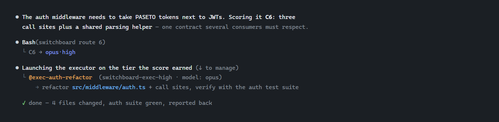
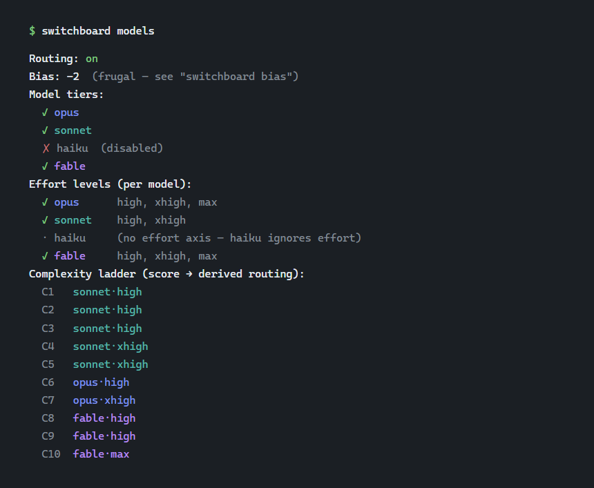
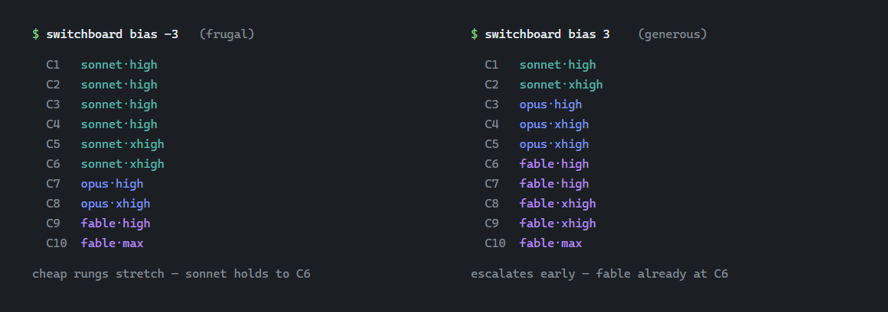

# switchboard

[](.claude-plugin/plugin.json)
[](https://claude.com/claude-code)
[](../../LICENSE)
[](https://github.com/sponsors/Eigenwise)
[](https://ko-fi.com/eigenwise)
[](https://discord.gg/J3W9b5AZJR)

*Part of the [eigenwise-toolshed](../../README.md), a small marketplace of Claude Code plugins by [Eigenwise](https://eigenwise.io).*

**Score the task, not the model.** Claude scores each piece of work for complexity (1 to 10),
switchboard turns that score into a model tier and a reasoning effort, and the work runs in a
named executor subagent at exactly that tier. Nobody hand-picks models anymore: the score is the
only knob, and a user-tunable ladder does the rest.



## Install

```text
/plugin marketplace add Eigenwise/eigenwise-toolshed
/plugin install switchboard@eigenwise-toolshed
```

Then run `/reload-plugins` (or restart Claude Code). That brings in the skill, five executor
agents, and the CLI. No dependencies, no build step: it's Node stdlib only (Claude Code already
ships Node), cross-platform.

## The idea

A Claude session is one fixed model. It can't change its own model mid-run, so every task it does
inline runs at whatever tier your session happens to be. That's laborer work at orchestrator
prices, or a genuinely hard problem on an underpowered model. Both waste something.

Switchboard splits the decision in two:

- **Claude scores complexity, out loud.** 1 to 10 against a task-shape scale anchored to
  Anthropic's own model positioning (1-2 is subagent-shaped work where the spec says everything,
  3-5 is daily coding, 6-7 is complex agentic work with a shared contract, 8-10 is
  larger-than-a-sitting or research-grade), with a one-line motivation naming the actual files
  and moving parts. Shapes are project-portable where "feels hard" isn't — that's what makes the
  scale absolute. Stating it visibly is the honesty mechanism: no silent scoring, no picking a
  tier first and backfilling a number.
- **The ladder picks the rung.** Your enabled tiers and efforts form one capability-ranked
  sequence of model×effort rungs, the score maps onto it, and the task runs in a
  `switchboard-exec-<effort>` subagent with the derived model. Change your prefs and the same
  score routes differently tomorrow. Claude's scoring never has to change.

## Getting started

Give the CLI a short name first (adjust the path to where your marketplace puts plugins; see
"Where things live" below):

```bash
alias switchboard='node "$HOME/.claude/plugins/marketplaces/eigenwise-toolshed/plugins/switchboard/bin/switchboard.js"'
```

Now look at your ladder:

```bash
switchboard models
```



Read it bottom-up: the ladder is the whole contract. A task scored C3 runs on `sonnet·high`. A C8
runs on `fable·high`. The tier and effort lists above it are what the ladder is built from, and
everything is yours to shape:

```bash
switchboard route 6            # what would a C6 get right now?
switchboard disable haiku      # drop a tier entirely
switchboard disable opus.medium  # or just one model·effort rung
switchboard bias -2            # hold cheaper rungs longer before escalating
```

That's the whole setup. From here you just hand Claude work. When you give it something worth
delegating, the bundled skill makes it score the task in its reply, ask switchboard for the rung,
and spawn the executor, like the session at the top of this page. Two guards mean you can't
configure yourself into a corner: at least one tier always stays enabled, and every enabled tier
keeps at least one effort.

If you want routing gone for a while, `switchboard routing off` switches the whole thing off, and
Claude works inline like before.

## The ladder

Routing isn't per-tier bands, it's one merged, capability-ranked sequence. Tiers overlap and cross
over: `sonnet·xhigh` outranks `opus·low`, because a cheaper model thinking harder often beats a
pricier one thinking less. Rungs are ordered by measured capability, wherever that lands them.
The rankings follow published benchmarks: the sonnet/opus boundary genuinely overlaps, while
fable sits strictly above opus at every effort, so the ladder models the two boundaries
differently instead of pretending the gaps are equal.

`max` effort sits outside the normal spread on purpose. Only complexity 10 reaches it (9 too, at
the most generous bias), matching Anthropic's own guidance to use max sparingly, for the hardest
work only. Normal day-to-day coding lands 1 to 7, and that's by design: 9s and 10s should be rare.

## The bias dial

The score is Claude's honest read of the task. How eagerly scores climb toward pricier rungs is
your call, and that's what bias is: `-5` frugal to `+5` generous, gamma-curving the score-to-rung
mapping.



The two ends never move: complexity 1 always gets the cheapest enabled rung and complexity 10
always gets the top one, at any bias. You're bending the middle of the curve, and open work
re-routes the moment you change it. Nothing is baked in at scoring time.

## The executors

Five bundled agents, `switchboard-exec-low` through `switchboard-exec-max`, one per effort rung.
Reasoning effort can only be pinned in an agent's frontmatter, so effort lives in the agent file
and the model is passed at spawn time; the two compose. Every spawn also gets a unique name
(`exec-auth-refactor`, not "agent 3"), which keeps it addressable and trackable, in fleet view and
as a teammate under agent teams.

An executor does exactly the delegated task, verifies the way the spawn prompt specifies, and
reports back concretely. If the work turns out to be beyond its tier, it escalates through the
`advisor` tool when one is available instead of thrashing, and otherwise stops and says exactly
where it got stuck so the orchestrator can re-route.

One rule the skill enforces on the orchestrator side: the session caps the model. A sonnet
session that derives `opus·high` spawns `switchboard-exec-high` at `model: sonnet`. The cap
lowers the model and keeps the effort.

All five agent files are generated from `scripts/_exec-template.md`; run
`scripts/gen-exec-agents.js` to regenerate after an edit rather than hand-editing five copies.

## CLI

```bash
switchboard models [--json]          # routing state, tiers, per-model efforts, live ladder
switchboard bias [<int>] [--json]    # read (no arg) or set (-5..5) the bias dial
switchboard route <c> [--json]       # derive one score's model/effort, e.g. route 6
switchboard enable <target...>       # turn on a tier (haiku) or a model.effort pair (opus.medium)
switchboard disable <target...>      # turn one off, same target shape
switchboard routing on|off           # master switch; off means switchboard stands down
```

Every command that changes something prints the reshaped ladder, so you always see what your
change did.

## Where things live

- **The plugin:** wherever your marketplace checkout put it; the CLI is `bin/switchboard.js`
  inside it. Claude resolves this itself via `${CLAUDE_PLUGIN_ROOT}`, the alias above is only for
  your own shell.
- **Your prefs:** one JSON file, `~/.claude/switchboard/prefs.json` (override the directory with
  the `SWITCHBOARD_HOME` env var). Tiers, the per-model effort matrix, bias, and the master
  switch. Delete it to reset to defaults: everything on, bias 0.

## Relation to sidequest

[sidequest](../sidequest) is this same routing engine plus a ticket board on top; switchboard is
the routing alone, for anyone who wants the ladder without a board. The engine is shared **by
copy**, not by dependency: each plugin carries its own `lib/ladder.js` and its own invariant
tests, and each plugin's tests are the source of truth for changes to its copy.

## Support

switchboard is free and MIT-licensed. If it saves you time, [a coffee](https://ko-fi.com/eigenwise) or [a GitHub sponsorship](https://github.com/sponsors/Eigenwise) genuinely helps me keep building and maintaining these tools.

| Ko-fi | GitHub Sponsors |
|:-----:|:---------------:|
| <a href="https://ko-fi.com/eigenwise"></a> | <a href="https://github.com/sponsors/Eigenwise"></a> |

## License

MIT (c) Eigenwise
